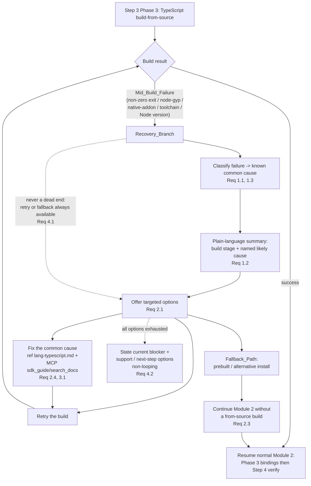

# Design Document

## Overview

Module 2 (SDK Setup) installs the Senzing SDK for the bootcamper's chosen language. For the
TypeScript path, `module-02-sdk-setup.md` Step 3 Phase 3 warns that the `sz-napi` binding **may
require building from source** — installing the Rust toolchain, resolving native-addon prerequisites
(`node-gyp`, a C++ compiler, Python 3), and compiling with `napi-rs`. That is the
**Build_From_Source_Path**, and it is the most failure-prone install path in the whole bootcamp.

Today, when the build fails partway (a **Mid_Build_Failure**), the module falls through to its
generic **Error Handling** block (`explain_error_code` for `SENZ` codes → `common-pitfalls.md` →
symptom table). That generic path is tuned for Senzing engine/runtime errors, not for a
half-finished native compile: it does not recognize a `gyp ERR!`, a missing toolchain, or a
Node-version mismatch, so the bootcamper is left staring at a raw build error with no guided next
step. The reactive troubleshooting content from `language-specific-troubleshooting` already exists
in `lang-typescript.md` ("Common Environment Issues"), but nothing in the Module 2 flow *routes* a
mid-build failure to it or offers a fallback.

This feature adds a dedicated **Recovery_Branch** to the Module 2 TypeScript build-from-source path.
When the build produces a Mid_Build_Failure, the flow (1) recognizes the failure and routes to the
Recovery_Branch instead of generic error handling, (2) summarizes what failed in plain language and
names the likely common cause, (3) offers targeted options — fix-the-common-cause, retry, or a
**Fallback_Path** (prebuilt / alternative install) — sourcing detailed fixes from
`lang-typescript.md` and the Senzing MCP server (`sdk_guide` / `search_docs`) with **no hardcoded
external URLs**, (4) resumes the normal Module 2 SDK-setup sequence on a successful retry, and
(5) always presents at least one non-blocking continuation so a build failure is never a dead end.

The feature is **steering-driven**: its deliverable is steering content and flow inside
`module-02-sdk-setup.md` (referencing `lang-typescript.md`), plus the mandatory
`steering-index.yaml` token-count update. There is no new runtime script and no new hook. The
testable surface is therefore steering-content/flow assertions, backed by a small **reference model**
of the recovery decision graph (failure-cause classes → recovery options → continuations) that lets
us state universal properties about routing, option coverage, and the never-a-dead-end guarantee.

### Design Goals

- Route a TypeScript Mid_Build_Failure to a dedicated Recovery_Branch instead of the module's
  generic error handling (Requirement 1).
- Give a plain-language failure summary that names the matched common cause before offering options
  (Requirements 1.2, 1.3).
- Offer a consistent triad — fix, retry, Fallback_Path — for every recognized failure, and resume /
  continue Module 2 on the chosen path (Requirement 2).
- Reuse, not duplicate: point at `lang-typescript.md` "Common Environment Issues" and MCP
  `sdk_guide` / `search_docs` for detailed fixes; keep the TypeScript-maturity framing consistent
  (Requirement 3).
- Guarantee a non-blocking continuation at every step and a clear, non-looping terminal state when
  options are exhausted (Requirement 4).
- Keep the power distribution rules: no hardcoded external URLs in steering (MCP-only facts), and
  the `steering-index.yaml` token counts stay in sync (`measure_steering.py --check`).

### Non-Goals

- Adding a runtime script, hook, or automated build-failure detector. Detection and routing are
  agent behavior driven by the steering flow, not code.
- Duplicating the toolchain fix content that already lives in `lang-typescript.md` "Common
  Environment Issues" — the branch references it (Requirement 3.1).
- Changing the non-TypeScript install paths, the EULA/license steps, or any other Module 2 step.
- Teaching the bootcamper to debug the native toolchain unaided, or guaranteeing the from-source
  build succeeds — the Fallback_Path exists precisely so success is never required (Requirement 2.3).

## Architecture

The Recovery_Branch is a new decision point inside `module-02-sdk-setup.md` Step 3 Phase 3, on the
TypeScript build-from-source path only. Conceptually it is a small state graph: the build either
succeeds (normal flow) or produces a Mid_Build_Failure that is classified into a **known common
cause**, summarized in plain language, and presented with the fix / retry / Fallback_Path options.
Retry-success resumes the normal SDK-setup sequence; the Fallback_Path continues Module 2 without a
from-source build; exhausting options lands in a distinct, non-looping "blocked + support" terminal
state.



### Placement and wiring

- The branch is inserted in `module-02-sdk-setup.md` **Step 3 Phase 3** (the TypeScript
  "may require building from source" warning), immediately after the from-source build sequence is
  described, so a failure during that sequence has a defined destination.
- The module's existing generic **Error Handling** block (SENZ-code lookup →
  `common-pitfalls.md` → symptom table) is left intact for engine/runtime errors; the Recovery_Branch
  is a TypeScript-build-specific pre-empt that keeps a Mid_Build_Failure from falling through to it
  (Requirement 1.1).
- Detailed fixes are **referenced, not inlined**: the branch points to `lang-typescript.md`
  "Common Environment Issues" (Node.js version conflicts, node-gyp native-addon build failures,
  ESM/CJS, strict-mode, package-manager conflicts) and to MCP `sdk_guide(topic='install', ...)` /
  `search_docs(category='anti_patterns')`. No external URLs are hardcoded (Requirements 2.4, 3.1).

### Steering-index synchronization

Editing `module-02-sdk-setup.md` changes its token count. Per the repo convention, the edit is
paired with a `steering-index.yaml` update so `measure_steering.py --check` stays green: update the
`token_count` for `module-02-sdk-setup.md` (both the module-tree entry near line 22 and the flat
`files:` entry near line 470) to the newly measured value, and re-check `size_category`
(`module-02-sdk-setup.md` is already `large`; the split-exclusion note in `steering-index.yaml`
records why this linear install flow stays contiguous, so no split is triggered) (Requirement 3.3).

## Components and Interfaces

### Steering content: `module-02-sdk-setup.md` Step 3 Phase 3 — Recovery_Branch

A new subsection ("Recovery: build-from-source failures (TypeScript)") added to Phase 3. Its
structure, expressed as agent instructions:

1. **Detection** — "If the from-source build exits non-zero or reports a native-addon / `node-gyp` /
   toolchain / Node-version failure, do **not** fall through to the module's generic Error Handling.
   Enter this recovery branch." (Requirement 1.1)
2. **Summary** — "State, in plain language, which build stage failed and the single most likely
   cause" (Requirements 1.2, 1.3), choosing the cause from the known-cause table below.
3. **Options** — always present, at minimum: **Fix the common cause**, **Retry the build**,
   **Fallback_Path** (Requirement 2.1).
4. **Sourcing** — "For the detailed fix steps, use `lang-typescript.md` → 'Common Environment
   Issues' and the Senzing MCP server (`sdk_guide`, `search_docs`). Never paste external URLs into
   this flow." (Requirements 2.4, 3.1)
5. **Resumption** — "On a successful retry, resume Phase 3 (install language bindings) and continue
   to Step 4 verification." (Requirement 2.2)
6. **Fallback continuation** — "If the build can't be repaired quickly, take the Fallback_Path and
   continue Module 2 without a successful from-source build." (Requirement 2.3)
7. **No dead end** — "There is always a way forward (retry after a fix, or the Fallback_Path). If
   every option is exhausted, state the current blocker and the support / next-step options; do not
   loop on the same error." (Requirements 4.1, 4.2)

### Known-cause table (in the branch, sourced from `lang-typescript.md`)

The branch names one of these known common causes for the summary (Requirement 1.3). Each maps to a
`lang-typescript.md` "Common Environment Issues" entry for the detailed fix (Requirement 3.1):

| Cause class | Failure signal | Fix reference (`lang-typescript.md`) |
|---|---|---|
| `NODE_VERSION` | `SyntaxError`, `ERR_UNSUPPORTED_ESM_URL_SCHEME`, Node < 18 | "Node.js Version Conflicts" |
| `NATIVE_ADDON` | `gyp ERR! build error`, `Cannot find module '.../*.node'` | "Native Addon Build Failures (node-gyp)" |
| `TOOLCHAIN` | missing C++ compiler / Rust toolchain / Visual Studio Build Tools | "Native Addon Build Failures (node-gyp)" + Module 2 Windows note |
| `MODULE_SYSTEM` | `ERR_REQUIRE_ESM`, `Cannot use import statement outside a module` | "ESM vs CommonJS Module Resolution" |
| `PKG_MANAGER` | `ERESOLVE`, lockfile conflicts | "Package Manager Conflicts" |

### Reference model (test-only): the recovery decision graph

To make the branch's flow universally testable, the test module encodes the branch as a small pure
reference model (in `senzing-bootcamp/tests/test_typescript_build_failure_recovery.py`, stdlib +
dataclasses). It is **not** shipped steering or a runtime script — it is the machine-checkable
specification the content tests are validated against.

```python
class CauseClass(Enum):
    NODE_VERSION = auto()
    NATIVE_ADDON = auto()
    TOOLCHAIN = auto()
    MODULE_SYSTEM = auto()
    PKG_MANAGER = auto()
    UNKNOWN = auto()          # unrecognized Mid_Build_Failure signal

class Option(Enum):
    FIX = auto()
    RETRY = auto()
    FALLBACK = auto()

class State(Enum):
    RECOVERY = auto()         # inside the Recovery_Branch, options offered
    RESUME_MODULE2 = auto()   # normal SDK-setup sequence resumed (retry success)
    CONTINUE_MODULE2 = auto() # continued via Fallback_Path (no from-source build)
    BLOCKED_WITH_SUPPORT = auto()  # options exhausted: blocker + support, non-looping

@dataclass(frozen=True)
class Recovery:
    cause: CauseClass
    summary: str              # plain-language, names the cause
    fix_reference: str        # lang-typescript.md entry title
    options: frozenset[Option]

def classify_failure(signal: str) -> CauseClass: ...     # signal -> cause class
def route(signal: str) -> State: ...                     # any Mid_Build_Failure -> RECOVERY
def build_recovery(cause: CauseClass) -> Recovery: ...   # cause -> summary + options
def transition(state: State, option: Option, retry_ok: bool) -> State: ...
def continuations(recovery: Recovery) -> frozenset[Option]:  # never empty
    return recovery.options & {Option.RETRY, Option.FALLBACK}
```

Model invariants (mirrored by the shipped steering and asserted by the properties):

- `route(signal)` is `RECOVERY` for every Mid_Build_Failure signal (Requirement 1.1).
- `build_recovery(cause).options ⊇ {FIX, RETRY, FALLBACK}` for every cause class (Requirement 2.1).
- `continuations(recovery)` is non-empty for every recovery (Requirement 4.1).
- `transition(RECOVERY, RETRY, retry_ok=True) == RESUME_MODULE2`;
  `transition(RECOVERY, FALLBACK, _) == CONTINUE_MODULE2` (Requirements 2.2, 2.3).
- Exhausting options yields `BLOCKED_WITH_SUPPORT`, which is distinct from `RECOVERY` and never
  re-enters the same error (Requirement 4.2).

### Reused / unchanged interfaces

- `lang-typescript.md` "Common Environment Issues" — the source of detailed fixes; **not modified**
  by this feature (referenced only).
- `module-02-sdk-setup.md` generic Error Handling / Troubleshooting blocks — unchanged; still handle
  SENZ engine/runtime errors.
- `scripts/measure_steering.py --check` — the existing token-count gate that validates the
  `steering-index.yaml` update (Requirement 3.3).

## Data Models

### Failure signal → cause class

`classify_failure` maps a raw build-failure signal (the salient token from the build output) to a
`CauseClass` using the known-cause table. Any Mid_Build_Failure signal that does not match a known
pattern classifies as `UNKNOWN`; `UNKNOWN` still routes to `RECOVERY` and still receives the full
option triad (so an unrecognized failure is never a dead end). The classification is total: every
input string yields exactly one `CauseClass`.

### Recovery presentation

For a given `CauseClass`, `build_recovery` returns a `Recovery` whose:

- `summary` is a non-empty plain-language string that names the cause (for known causes, the cause
  name; for `UNKNOWN`, "an unrecognized build failure") — satisfying "summarize before options"
  (Requirements 1.2, 1.3).
- `fix_reference` is the title of the corresponding `lang-typescript.md` "Common Environment Issues"
  entry (for `UNKNOWN`, a general pointer to that section plus MCP `search_docs`) — Requirement 3.1.
- `options` always contains `{FIX, RETRY, FALLBACK}` (Requirement 2.1).

### State transitions

| From | Option | Condition | To | Requirement |
|---|---|---|---|---|
| `RECOVERY` | `RETRY` | build succeeds | `RESUME_MODULE2` | 2.2 |
| `RECOVERY` | `RETRY` | build fails again | `RECOVERY` (re-classified) | 1.1, 4.1 |
| `RECOVERY` | `FIX` | — | `RECOVERY` (then retry) | 2.1 |
| `RECOVERY` | `FALLBACK` | — | `CONTINUE_MODULE2` | 2.3 |
| `RECOVERY` | (all exhausted) | — | `BLOCKED_WITH_SUPPORT` | 4.2 |

Both `RESUME_MODULE2` and `CONTINUE_MODULE2` re-enter the normal Module 2 sequence; the difference is
only whether the SDK came from a successful from-source build (`RESUME`) or the Fallback_Path
(`CONTINUE`). Neither requires the from-source build to have succeeded except `RESUME` by definition.

### Content-sourcing invariant

The Recovery_Branch text is subject to the power's steering security rules: **no hardcoded external
URLs** (the only allowed endpoint, the MCP server URL, lives in `mcp.json`, not steering). All
external/toolchain knowledge is sourced via `sdk_guide` / `search_docs` or `lang-typescript.md`
(Requirement 2.4). This is a property over the branch text: no `http(s)://` substring appears within
the recovery subsection.

## Correctness Properties

*A property is a characteristic or behavior that should hold true across all valid executions of a
system — essentially, a formal statement about what the system should do. Properties serve as the
bridge between human-readable specifications and machine-verifiable correctness guarantees.*

Even though the feature is steering-driven, property-based testing IS appropriate here: the recovery
flow is a small, pure decision graph (classification, option coverage, transitions, the no-dead-end
invariant) with a large input space of failure signals, and the branch↔`lang-typescript.md` mapping
is a cross-file consistency relation that must hold for every cause class. Each property below is
universally quantified and implemented as a single Hypothesis property test; example counts come
from the active Hypothesis profile baseline (no hand-set `max_examples`). Content properties read the
**real** steering files (`module-02-sdk-setup.md`, `lang-typescript.md`).

### Property 1: Every Mid_Build_Failure routes to the Recovery_Branch

*For any* Mid_Build_Failure signal (non-zero build exit, `node-gyp` / native-addon error, missing
toolchain, or unsupported Node version — recognized or not), `route(signal)` is `RECOVERY`, i.e. the
flow enters the Recovery_Branch rather than the module's generic error handling.

**Validates: Requirements 1.1**

### Property 2: The summary names the matched common cause

*For any* cause class, `build_recovery(cause)` produces a non-empty plain-language summary that names
that cause, and for every *known* common cause (missing toolchain, node-gyp prerequisites,
unsupported Node version, module-system, package-manager) the named cause matches a known-cause entry.

**Validates: Requirements 1.2, 1.3**

### Property 3: Every recovery offers the fix / retry / fallback triad

*For any* cause class, the offered options include, at minimum, fix-the-common-cause guidance, a
retry of the build, and a Fallback_Path.

**Validates: Requirements 2.1**

### Property 4: Chosen recovery paths continue Module 2

*For any* recovery, choosing retry after a successful build transitions to `RESUME_MODULE2` (the
normal SDK-setup sequence), and choosing the Fallback_Path transitions to `CONTINUE_MODULE2` without
requiring a successful from-source build.

**Validates: Requirements 2.2, 2.3**

### Property 5: A build failure is never a dead end

*For any* cause class and *any* sequence of failed retries, the set of available continuations
(`continuations(recovery)`) is non-empty — at least one of retry-after-fix or Fallback_Path is always
present while the branch is active.

**Validates: Requirements 4.1**

### Property 6: Exhausting options reaches a distinct, non-looping terminal state

*For any* recovery whose options are all exhausted, the flow transitions to `BLOCKED_WITH_SUPPORT` —
a state that names the current blocker and support / next-step options, is distinct from the active
`RECOVERY` state, and does not re-enter the originating error.

**Validates: Requirements 4.2**

### Property 7: Recovery guidance is MCP/lang-typescript-sourced with no hardcoded URLs

*For any* line of the Recovery_Branch subsection in `module-02-sdk-setup.md`, the text contains no
hardcoded external `http(s)://` URL, and the subsection references the Senzing MCP tools
(`sdk_guide` / `search_docs`) and `lang-typescript.md` for detailed fixes.

**Validates: Requirements 2.4**

### Property 8: Every named cause maps to a lang-typescript.md troubleshooting entry

*For any* known common cause named by the branch, a corresponding entry exists in the
`lang-typescript.md` "Common Environment Issues" section, so the branch references — rather than
duplicates — the reactive TypeScript troubleshooting content.

**Validates: Requirements 3.1**

## Error Handling

The Recovery_Branch is itself the module's error-handling refinement for the TypeScript build path,
so "error handling" here means how the *branch* behaves at its own edges:

| Situation | Handling |
|---|---|
| Unrecognized Mid_Build_Failure signal | Classifies as `UNKNOWN`; still routes to `RECOVERY`, still gets the full fix/retry/fallback triad, with the fix pointing at the whole `lang-typescript.md` "Common Environment Issues" section plus MCP `search_docs` (Requirements 1.1, 2.1, 4.1). |
| Retry fails again | Re-enters `RECOVERY` (re-classified on the new signal); the option triad and continuations are re-offered — never a silent loop (Requirements 1.1, 4.1). |
| Fix can't be applied / build can't be repaired quickly | Fallback_Path is always offered and continues Module 2 without a from-source build (Requirement 2.3). |
| All options exhausted | Terminates in `BLOCKED_WITH_SUPPORT`: state the current blocker and support / next-step options; do not loop on the same error (Requirement 4.2). |
| MCP tool unavailable when fetching a fix | The branch still has `lang-typescript.md` content and the Fallback_Path; guidance degrades gracefully rather than dead-ending (Requirements 2.4, 4.1). |
| Falling through to generic error handling | Explicitly prevented: the branch pre-empts the SENZ-code / `common-pitfalls.md` generic path for a Mid_Build_Failure (Requirement 1.1). |

The generic Module 2 Error Handling block (SENZ codes → `common-pitfalls.md` → symptom table)
remains the handler for engine/runtime errors and is unchanged by this feature.

## Testing Strategy

Tests live in `senzing-bootcamp/tests/test_typescript_build_failure_recovery.py`, follow the project
pattern (pytest + Hypothesis, class-based, `sys.path` import of scripts where needed), and property
tests draw their example count from the active Hypothesis profile (`fast`=5 locally, `thorough`=100
in CI) — no hand-set `max_examples`. Fixtures are synthetic; no real PII, credentials, or connection
strings (power-distribution safety rule). Tests are the deliverable required by Requirement 5, and
following this pattern satisfies Requirements 5.1 and 5.2.

### Property-based tests (Hypothesis)

Properties 1–8 map one-to-one to tests. Each is tagged:

`# Feature: typescript-build-failure-recovery, Property {number}: {property_text}`

The model-level properties (1–6) exercise the pure reference model (the recovery decision graph);
the content properties (7–8) read the **real** steering files. Custom strategies (prefixed `st_`)
generate the inputs:

- `st_failure_signal()` — Mid_Build_Failure signal strings: known-pattern signals for each cause
  class (e.g. `gyp ERR! build error`, `ERR_UNSUPPORTED_ESM_URL_SCHEME`, `ERESOLVE`), plus arbitrary
  non-matching strings that must classify as `UNKNOWN` and still route to `RECOVERY` (Property 1) and
  still receive continuations (Property 5).
- `st_cause_class()` — `sampled_from` the `CauseClass` enum, driving Properties 2–4.
- `st_retry_sequence()` — sequences of failed-then-eventual retry outcomes, driving Properties 5–6
  (the no-dead-end invariant across repeated failures and the exhaustion terminal state).

Property 5 is the headline no-dead-end guarantee (Requirement 4.1): for any cause class and any
sequence of failed retries, a continuation always remains available.

### Unit / example tests

Complement the properties with focused, concrete checks:

- **Routing pre-empt** — a `gyp ERR!` example enters the Recovery_Branch and not the generic SENZ /
  `common-pitfalls.md` path (Requirement 1.1).
- **Summary-before-options ordering** — in the real steering, the plain-language summary instruction
  appears before the options list within the Recovery_Branch subsection (Requirement 1.2).
- **Option triad present in steering** — the branch text lists fix, retry, and Fallback_Path
  (Requirement 2.1).
- **Resume vs. continue** — retry-success resumes Phase 3 → Step 4; Fallback_Path continues Module 2
  (Requirements 2.2, 2.3).
- **Maturity-framing consistency** — the fallback framing stays consistent with
  `typescript-language-maturity` (e.g. it does not contradict the existing "TypeScript setup is more
  involved … Java or C# typically have simpler install paths" warning) (Requirement 3.2, EXAMPLE).
- **Terminal-state content** — the exhaustion path states a blocker + support/next-step options and
  does not instruct re-running the same failing command (Requirement 4.2).

### Configuration / smoke checks

- **Steering-index token sync** — `steering-index.yaml` `token_count` for `module-02-sdk-setup.md`
  (both entries) matches the measured count; equivalently `measure_steering.py --check` passes
  (Requirement 3.3). This is a single deterministic check, not a property.

### Why no runtime-integration test

The feature ships steering content, not a script or hook, so there is no runtime wiring to integrate.
The end-to-end behavior — a failure signal producing a routed, option-bearing, never-dead-end
recovery — is fully captured by the reference-model properties plus the real-steering content tests
above.
