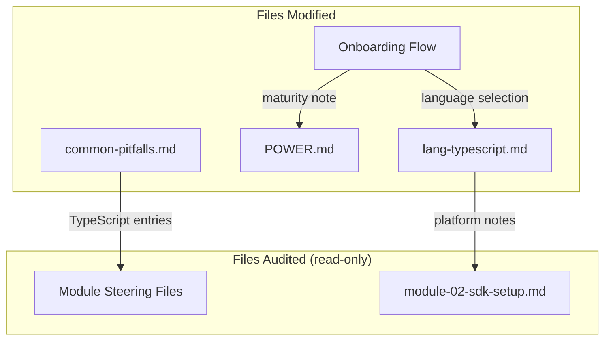

# Design: TypeScript/Node.js Language Maturity Alignment

## Overview

This feature audits and improves TypeScript/Node.js language support across the senzing-bootcamp power to ensure accurate representation of maturity differences compared to Python, Java, and C#. The work involves:

1. Auditing module steering files for TypeScript-specific guidance gaps
2. Adding maturity notes where `find_examples` coverage is lower
3. Verifying `generate_scaffold` and `sdk_guide` output quality for TypeScript
4. Adding TypeScript-specific troubleshooting entries to `common-pitfalls.md`
5. Updating `lang-typescript.md` with platform-specific notes
6. Ensuring the onboarding language selection prompt does not imply equal support depth

The changes are documentation-only (Markdown steering files and YAML configs). No Python scripts or test infrastructure changes are needed for the feature itself — only new tests validating the documentation changes.

## Architecture

This feature modifies existing steering files and documentation. No new architectural components are introduced.



### Design Decisions

1. **No separate maturity matrix file** — Maturity notes are embedded inline in `POWER.md` and `lang-typescript.md` rather than creating a new file. Rationale: the power ships everything in `senzing-bootcamp/`; a separate matrix adds context budget pressure without proportional value.

2. **Onboarding uses MCP-returned warnings** — Rather than hardcoding maturity differences in the onboarding prompt, the design relies on the existing MCP warning relay mechanism (already in `onboarding-flow.md` Step 2) plus a new general disclaimer. Rationale: the MCP server is the source of truth for language support status.

3. **Troubleshooting entries in `common-pitfalls.md`** — TypeScript-specific pitfalls go in the existing `common-pitfalls.md` under a new `## TypeScript/Node.js Pitfalls` section rather than only in `lang-typescript.md`. Rationale: `common-pitfalls.md` is loaded when users are stuck; having TypeScript entries there ensures discoverability during troubleshooting.

4. **Audit results documented as inline notes** — Rather than a separate audit report, findings are incorporated directly into the affected steering files. Rationale: the power has no dev-only files; everything ships.

## Components and Interfaces

### Modified Files

| File | Change Type | Description |
|------|-------------|-------------|
| `steering/lang-typescript.md` | Update | Add maturity notes section, platform-specific notes from audit |
| `POWER.md` | Update | Add language support depth note in Code Generation section |
| `steering/common-pitfalls.md` | Update | Add TypeScript/Node.js pitfalls section |
| `steering/onboarding-flow.md` | Update | Add support depth disclaimer to language selection step |

### Audit Scope (Read-Only)

All module steering files (`module-01-*` through `module-11-*`) are audited for TypeScript-specific guidance gaps. The audit checks:

- Whether workflow instructions reference TypeScript-specific patterns (async/await, ESM/CJS)
- Whether `generate_scaffold` calls include `language='typescript'` examples
- Whether error handling guidance accounts for Node.js-specific failure modes

### Validation Interface

A new test file `tests/test_typescript_language_maturity.py` validates:

- Maturity notes exist in `lang-typescript.md` and `POWER.md`
- TypeScript pitfalls section exists in `common-pitfalls.md`
- Onboarding flow contains support depth disclaimer
- All language files maintain structural parity (same section headings)

## Data Models

No new data models are introduced. The feature modifies Markdown content and validates structural properties of existing files.

### Content Structure Requirements

**Maturity Note Format** (in `lang-typescript.md`):

```markdown
## SDK Maturity Notes

> **Note:** TypeScript/Node.js SDK support may have fewer `find_examples` results
> compared to Python and Java. The MCP server's `generate_scaffold` and `sdk_guide`
> tools produce equivalent-quality output for all supported workflows. If you
> encounter a gap, use `search_docs` or ask for help.
```

**Onboarding Disclaimer Format** (in `onboarding-flow.md` Step 2):

```markdown
> **Note:** All listed languages produce working code via the MCP server's
> `generate_scaffold` tool. However, the depth of supplementary examples
> (via `find_examples`) may vary — Python and Java currently have the most
> extensive example coverage. This does not affect the bootcamp workflow.
```

**Common Pitfalls Section Format** (in `common-pitfalls.md`):

```markdown
## TypeScript/Node.js Pitfalls

| Pitfall | Fix |
| ------- | --- |
| ... | ... |
```

## Correctness Properties

*A property is a characteristic or behavior that should hold true across all valid executions of a system — essentially, a formal statement about what the system should do. Properties serve as the bridge between human-readable specifications and machine-verifiable correctness guarantees.*

### Property 1: Language steering file structural parity

*For any* language steering file in the set {lang-python.md, lang-java.md, lang-csharp.md, lang-rust.md, lang-typescript.md}, it SHALL contain all required section headings (## Senzing SDK Best Practices, ## Common Pitfalls, ## Performance Considerations, ## Code Style for Generated Code, ## Platform Notes, ## Common Environment Issues) AND the Platform Notes section SHALL reference at least Linux, Windows, and macOS.

**Validates: Requirements 1, 5**

### Property 2: Maturity notes presence in designated files

*For any* file in the set {lang-typescript.md, POWER.md}, it SHALL contain a support depth or maturity note that acknowledges varying `find_examples` coverage across languages.

**Validates: Requirements 2**

### Property 3: TypeScript pitfall topic coverage

*For any* required TypeScript pitfall topic in the set {async patterns, type definitions, ESM/CJS module resolution}, the `common-pitfalls.md` TypeScript/Node.js section SHALL contain an entry addressing that topic.

**Validates: Requirements 4**

## Error Handling

This feature is documentation-only. There are no runtime error conditions to handle. The primary failure mode is:

- **Missing or malformed content**: If a steering file is edited and loses required sections, the property-based tests will catch the regression. The CI pipeline (`validate_power.py`, `validate_commonmark.py`) already validates Markdown structure.
- **MCP server unavailability during audit**: The audit of `generate_scaffold`/`sdk_guide` output quality (Requirement 3) depends on the MCP server. If unavailable, the audit is deferred — this is documented as an integration test, not automated in CI.

## Testing Strategy

### Approach

This feature uses a **dual testing approach**:

- **Property-based tests** (Hypothesis): Verify universal structural properties across all language files
- **Unit tests** (pytest): Verify specific content presence and format in individual files

### Property-Based Testing

**Library**: Hypothesis (Python)
**Minimum iterations**: 100 per property test
**Tag format**: `Feature: typescript-language-maturity, Property {N}: {description}`

Property tests validate that structural invariants hold across all language steering files regardless of which file is selected. This catches regressions where an edit to one file breaks parity with others.

### Test File

`senzing-bootcamp/tests/test_typescript_language_maturity.py`

### Test Plan

| Test Type | What It Validates | Requirement |
|-----------|-------------------|-------------|
| Property 1 | All language files have same required sections + platform coverage | Req 1, 5 |
| Property 2 | Maturity notes exist in lang-typescript.md and POWER.md | Req 2 |
| Property 3 | TypeScript pitfall topics covered in common-pitfalls.md | Req 4 |
| Unit test | Onboarding flow Step 2 contains support depth disclaimer | Req 6 |
| Unit test | common-pitfalls.md has a TypeScript/Node.js section heading | Req 4 |
| Integration (manual) | `generate_scaffold` TypeScript output quality | Req 3 |

### Why PBT Applies

The feature's correctness conditions are structural invariants over a set of files. Property-based testing is appropriate because:

- The input space (language file selections, pitfall topic selections) is enumerable but benefits from randomized coverage
- Universal properties ("for all language files, X holds") map directly to `@given(lang=st.sampled_from(...))`
- 100 iterations ensure all combinations are exercised even as the file set grows
- Pure function behavior: reading files and checking regex patterns is deterministic and cost-free

