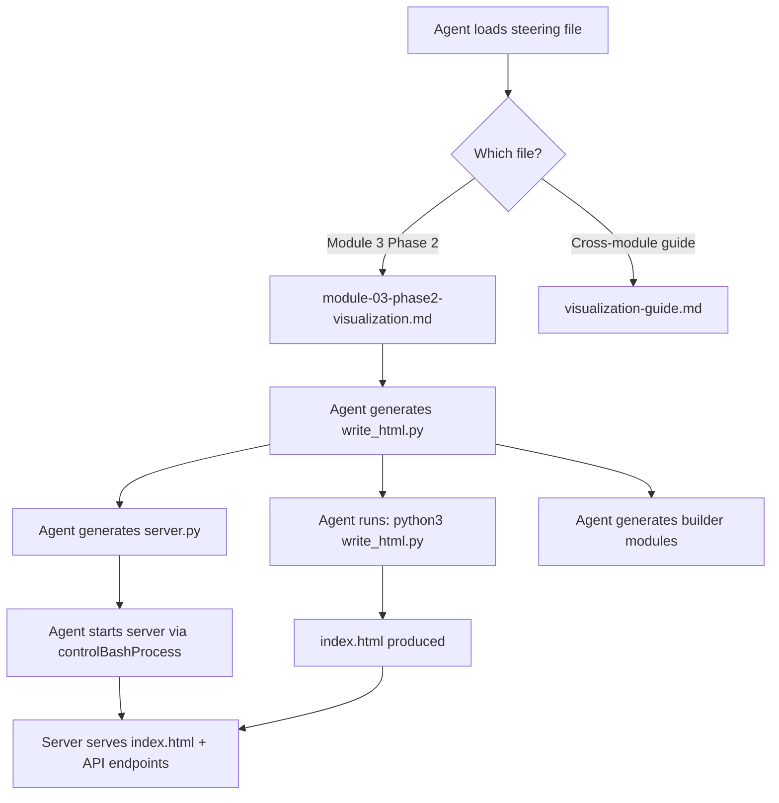
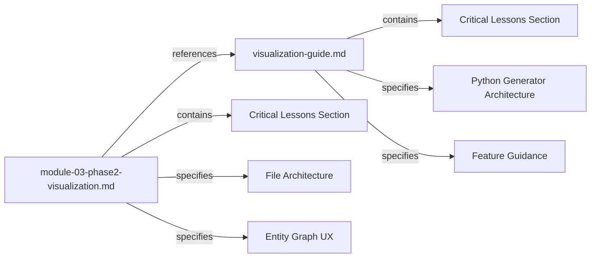

# Design Document: Visualization Enhancements

## Overview

This design specifies changes to two steering files in the Senzing Bootcamp Power:

1. `senzing-bootcamp/steering/module-03-phase2-visualization.md` — the Module 3 visualization generation steering
2. `senzing-bootcamp/steering/visualization-guide.md` — the cross-module visualization reference guide

The changes replace the MCP scaffold-based generation approach (`generate_scaffold(workflow='web_service')`) with a Python generator script pattern (`write_html.py` → `index.html`), add a "CRITICAL LESSONS FOR VISUALIZATION GENERATION" section to both files, specify Entity Graph UX enhancements (labels, click-to-detail, zoom/pan, legend, responsive resize), mandate D3.js code style constraints, and preserve the existing API/tab structure.

These are **steering-only changes** — no application code ships with the power. The steering files instruct the agent how to generate visualization artifacts at runtime for the bootcamper.

### Key Design Decisions

| Decision | Rationale |
|----------|-----------|
| Python generator script (`write_html.py`) over `generate_scaffold` | Avoids quote-escaping failures when agent writes HTML+JS via `fs_write`/`str_replace`. Triple-quoted Python strings eliminate nested quote conflicts. |
| Critical Lessons in both files | Either file may be loaded independently depending on module context. Duplicating constraints ensures the agent always sees them. |
| `function(){}` over arrow functions in D3.js | Arrow functions break `this` binding in D3 callbacks where `this` refers to the DOM element. |
| Explicit SVG `width`/`height` attributes | CSS-only sizing causes rendering issues in some browsers and when SVG is embedded in flex containers. |
| `data-*` attributes over inline `onclick` | Dynamic values in inline handlers cause quote-escaping failures in the Python generator. `querySelectorAll` with `data-*` attributes is robust. |

## Architecture

The architecture is a steering-file-driven code generation pipeline. No runtime code ships with the power — the steering files instruct the agent to generate all artifacts.



### File Generation Architecture

```
src/system_verification/web_service/
├── write_html.py          # Python generator: triple-quoted HTML string → index.html
├── index.html             # Generated output (not hand-written)
├── server.py              # Python stdlib HTTP server (HTTPServer + BaseHTTPRequestHandler)
├── stats_builder.py       # Statistics computation from export_json_entity_report
├── graph_builder.py       # Graph node/edge construction from SDK
├── merges_builder.py      # Multi-record entity extraction from SDK
└── search_builder.py      # Search-by-attributes wrapper
```

### Steering File Relationship



Both files contain the Critical Lessons section independently. Module 3 Phase 2 is the primary specification for the web service visualization. The Visualization Guide provides cross-module reference and mandates the Python generator approach for all visualization generation.

## Components and Interfaces

### Component 1: Module 03 Phase 2 Steering File

**File:** `senzing-bootcamp/steering/module-03-phase2-visualization.md`

**Sections to modify:**

| Section | Change |
|---------|--------|
| Step 9.1 "Generate Web Service" | Replace `generate_scaffold(workflow='web_service')` with `write_html.py` generator instructions |
| Required files table | Add `write_html.py`, keep all other files |
| New: "CRITICAL LESSONS FOR VISUALIZATION GENERATION" | Add after Implementation constraints |
| Entity_Graph tab spec | Add node labels, edge labels, click-to-detail modal, zoom/pan, color legend, responsive resize |
| New: D3.js Code Style Constraints | Add `function(){}` mandate, explicit SVG dimensions |

**Sections to preserve unchanged:**

- API Endpoints (9.2): `/api/stats`, `/api/graph`, `/api/merges`, search endpoint
- Tab structure: Entity_Graph, Record_Merges_View, Merge_Statistics, Probe_Panel
- Summary_Banner specification
- Web Service Delivery Sequence reference
- Checkpoint and verification steps (9.4)

### Component 2: Visualization Guide Steering File

**File:** `senzing-bootcamp/steering/visualization-guide.md`

**Sections to modify:**

| Section | Change |
|---------|--------|
| New: "CRITICAL LESSONS FOR VISUALIZATION GENERATION" | Add after "Visualization Offer Protocol" section |
| "Visualization Feature Guidance" | Add node labels, edge labels, click-to-detail modal, zoom/pan, color legend, responsive resize as required features |
| New: "Python Generator Architecture" | Add as mandated approach for all visualization generation |
| New: D3.js constraints in Critical Lessons | `function(){}` syntax, explicit SVG dimensions |

**Sections to preserve unchanged:**

- Visualization Offer Protocol (checkpoint map, offer template, delivery-mode selection, dispatch rules, decline handling)
- Graph Data Model Schema
- Match Strength Classification
- Static HTML Capabilities
- Error Handling
- File Placement
- Visualization Tracker

### Interface: Critical Lessons Section (shared content)

Both steering files will contain this section with identical constraints:

```markdown
## CRITICAL LESSONS FOR VISUALIZATION GENERATION

1. **Use Python generator script** — Create `write_html.py` with HTML as a triple-quoted string. Run `python3 write_html.py` to produce `index.html`. NEVER use `fs_write` or `str_replace` to write HTML+JS content directly.
2. **Validate JavaScript syntax** — After generating `index.html`, run `node --check index.html` equivalent validation or embed the JS in a way that can be syntax-checked.
3. **No inline onclick with dynamic values** — Use `data-*` attributes and `querySelectorAll` event listeners. Inline `onclick="fn('${value}')"` causes quote-escaping failures.
4. **Quote discipline** — Inside Python triple-quoted strings: use double quotes for JavaScript strings, single quotes for HTML attributes.
5. **D3.js callback syntax** — Use `function(){}` for all D3.js callbacks, NOT arrow functions. Arrow functions break `this` binding to DOM elements.
6. **Explicit SVG dimensions** — Set `width` and `height` attributes on SVG elements. Do not rely on CSS-only sizing.
```

### Interface: Entity Graph UX Enhancements

New features specified in Module 03 Phase 2 steering and referenced in Visualization Guide Feature Guidance:

| Feature | Specification |
|---------|--------------|
| Node labels | Text labels showing entity name, truncated to 20 characters max |
| Edge labels | Text labels showing match key string (e.g., +NAME+ADDRESS) |
| Click-to-detail modal | Click node → modal with entity ID, primary name, data sources, record count, constituent records |
| Zoom/pan | D3.js zoom behavior: mouse wheel to zoom, drag to pan |
| Color legend | Legend mapping data source names to node colors (CUSTOMERS=#3b82f6, REFERENCE=#22c55e, WATCHLIST=#f59e0b) |
| Responsive resize | Window resize → update SVG dimensions and re-center force simulation |

## Data Models

This feature modifies steering files (markdown documents), not application data models. However, the steering files specify data contracts that the agent must follow when generating code.

### Steering File Structure (YAML Frontmatter)

Both files retain their existing frontmatter:

```yaml
---
inclusion: manual
---
```

### Specified API Data Contracts (unchanged)

The following API response schemas are preserved exactly as-is in the steering files:

**GET /api/stats response:**
```json
{
  "records_total": "number",
  "entities_total": "number",
  "multi_record_entities": "number",
  "cross_source_entities": "number",
  "relationships_total": "number",
  "histogram": {"bucket_label": "count"}
}
```

**GET /api/graph response:**
```json
{
  "nodes": [{"entity_id": "number", "entity_name": "string", "record_count": "number", "data_sources": ["string"], "records": [{"data_source": "string", "record_id": "string"}]}],
  "edges": [{"source_entity_id": "number", "target_entity_id": "number", "match_key": "string", "relationship_type": "string"}]
}
```

**GET /api/merges response:**
```json
[{"entity_id": "number", "entity_name": "string", "match_key": "string", "records": [{"data_source": "string", "record_id": "string", "name": "string", "address": "string", "phone": "string", "identifiers": {}}]}]
```

### Entity Graph Node Visual Model (enhanced)

| Property | Value | Source |
|----------|-------|--------|
| Color | By primary data source: CUSTOMERS=#3b82f6, REFERENCE=#22c55e, WATCHLIST=#f59e0b | Existing |
| Radius | `min(max(8 + record_count × 4, 8), 40)` | Existing |
| Label | Entity name, truncated to 20 chars | **New** |
| Click action | Open detail modal | **New** |

### Entity Graph Edge Visual Model (enhanced)

| Property | Value | Source |
|----------|-------|--------|
| Label | Match key string (e.g., +NAME+ADDRESS) | **New** |
| Tooltip | Match key on hover | Existing |

### Click-to-Detail Modal Data Model (new)

| Field | Source |
|-------|--------|
| Entity ID | `node.entity_id` |
| Primary Name | `node.entity_name` |
| Data Sources | `node.data_sources` |
| Record Count | `node.record_count` |
| Constituent Records | `node.records` (data_source + record_id per record) |


## Correctness Properties

*A property is a characteristic or behavior that should hold true across all valid executions of a system — essentially, a formal statement about what the system should do. Properties serve as the bridge between human-readable specifications and machine-verifiable correctness guarantees.*

### Property 1: Critical Lessons section completeness across steering files

*For any* steering file that contains a "CRITICAL LESSONS FOR VISUALIZATION GENERATION" section, that section SHALL contain ALL of the following mandatory constraints: (1) Python generator script instruction, (2) warning against fs_write/str_replace for HTML+JS, (3) node --check or JavaScript syntax validation, (4) data-* attributes with querySelectorAll over inline onclick, (5) quote discipline (double quotes for JS, single quotes for HTML attributes), (6) function(){} syntax mandate for D3.js callbacks, (7) explicit SVG width/height attributes.

**Validates: Requirements 2.3, 2.4, 2.5, 2.6, 6.1, 6.2, 6.3**

### Property 2: Visualization Guide Feature Guidance contains all required Entity Graph features

*For any* required Entity Graph UX feature from the set {node labels, edge labels, click-to-detail modal, zoom/pan, color legend, responsive resize}, the Visualization Guide's Feature Guidance section SHALL reference that feature.

**Validates: Requirements 3.4, 4.4**

### Property 3: Click-to-detail modal specifies all required fields

*For any* required click-to-detail modal field from the set {entity ID, primary name, data sources, record count, constituent records}, the Module 03 Phase 2 steering file's Entity Graph specification SHALL mention that field.

**Validates: Requirements 3.3**

### Property 4: All required API endpoints are specified

*For any* required API endpoint from the set {/api/stats, /api/graph, /api/merges, search}, the Module 03 Phase 2 steering file SHALL specify that endpoint.

**Validates: Requirements 5.2, 7.1**

### Property 5: All required tabs are specified

*For any* required tab from the set {Entity_Graph, Record_Merges_View, Merge_Statistics, Probe_Panel}, the Module 03 Phase 2 steering file SHALL reference that tab.

**Validates: Requirements 7.2**

## Error Handling

Since this feature modifies steering files (not application code), error handling applies to the **test suite** and **CI validation**:

| Error Condition | Handling |
|-----------------|----------|
| Steering file not found at expected path | Test fails with clear path error message |
| Section heading not found in file | Test fails indicating missing section |
| Required constraint text not found | Test fails listing which constraint is missing |
| YAML frontmatter malformed | CI `validate_commonmark.py` catches this |
| Steering file exceeds token budget | CI `measure_steering.py --check` catches this |

No runtime error handling is needed because steering files are static markdown documents validated at CI time.

## Testing Strategy

### Approach

This feature uses **property-based testing with Hypothesis** to validate steering file content. The established pattern in this project (see `test_visualization_enforcement_properties.py`) reads steering files at module load time and uses `st.sampled_from()` strategies to draw from sets of required elements.

**Why PBT applies here:** The properties are universally quantified over sets of required constraints/features/endpoints/tabs. Property-based testing with `st.sampled_from()` ensures every element in each set is tested across randomized orderings, catching issues where a subset of requirements might be accidentally omitted.

### Test File

`senzing-bootcamp/tests/test_visualization_enhancements_properties.py`

### Property-Based Testing Configuration

- **Library:** Hypothesis (already in project dependencies)
- **Iterations:** `@settings(max_examples=100)` per property test
- **Strategy pattern:** `st.sampled_from()` over required element sets
- **Tag format:** `Feature: visualization-enhancements, Property {N}: {title}`

### Test Structure

```python
class TestCriticalLessionsCompleteness:
    """Feature: visualization-enhancements, Property 1: Critical Lessons section completeness"""
    # For any steering file with Critical Lessons, all 7 constraints present

class TestFeatureGuidanceCompleteness:
    """Feature: visualization-enhancements, Property 2: Feature Guidance contains all required features"""
    # For any required UX feature, Feature Guidance references it

class TestClickToDetailModalFields:
    """Feature: visualization-enhancements, Property 3: Click-to-detail modal fields"""
    # For any required modal field, Module 03 specifies it

class TestApiEndpointsSpecified:
    """Feature: visualization-enhancements, Property 4: All API endpoints specified"""
    # For any required endpoint, Module 03 specifies it

class TestTabsSpecified:
    """Feature: visualization-enhancements, Property 5: All tabs specified"""
    # For any required tab, Module 03 references it
```

### Unit Tests (Example-Based)

Additional example-based tests for single-check criteria:

| Test | Validates |
|------|-----------|
| `test_no_generate_scaffold_reference` | Req 1.2 — absence of `generate_scaffold(workflow='web_service')` |
| `test_write_html_py_in_required_files` | Req 1.1 — `write_html.py` mentioned as generator |
| `test_critical_lessons_heading_in_module03` | Req 2.1 — section heading exists |
| `test_critical_lessons_heading_in_viz_guide` | Req 2.2 — section heading exists |
| `test_node_labels_specified` | Req 3.1 — node text labels with truncation |
| `test_edge_labels_specified` | Req 3.2 — edge text labels with match key |
| `test_zoom_pan_specified` | Req 4.1 — D3.js zoom behavior |
| `test_color_legend_specified` | Req 4.2 — color legend |
| `test_responsive_resize_specified` | Req 4.3 — responsive resize |
| `test_python_generator_architecture_in_viz_guide` | Req 5.3 — mandated approach |
| `test_summary_banner_preserved` | Req 7.3 — Summary_Banner with 5 stats |
| `test_delivery_sequence_reference_preserved` | Req 7.4 — Web Service Delivery Sequence |

### CI Integration

Tests run as part of the existing `pytest` step in `.github/workflows/validate-power.yml`. No additional CI configuration needed.
