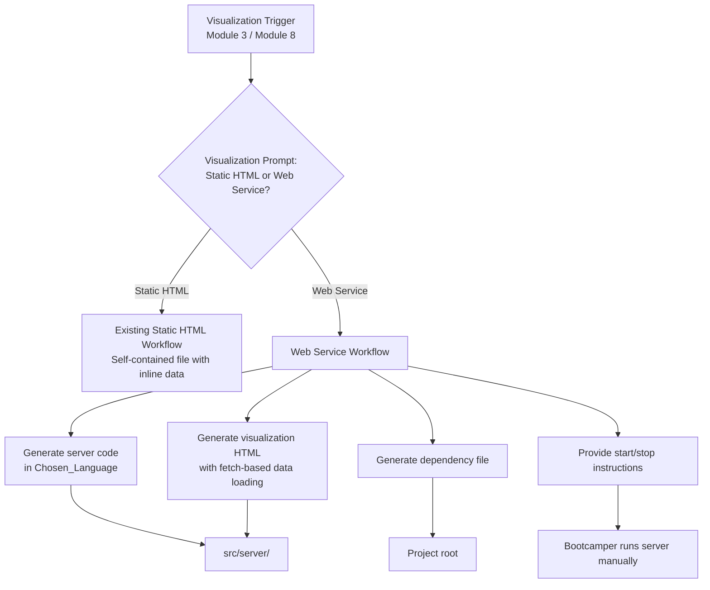
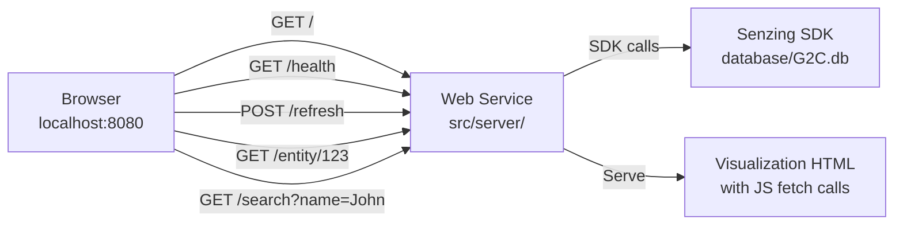

# Design Document: Visualization Web Service

## Overview

This feature adds a localhost web service as an alternative visualization delivery mode alongside the existing static HTML file approach. Currently, every visualization in the bootcamp (Module 3 demo results, Module 8 entity graph, Module 8 results dashboard) produces a self-contained HTML file. This design introduces a choice point before each visualization: the agent asks the bootcamper whether they want a static HTML file or a web service, then generates the appropriate output.

The web service provides three capabilities beyond static HTML:
1. **Live entity detail queries** — click an entity to fetch its full resolution details from the SDK in real time
2. **Data refresh** — re-query the SDK and update the visualization without regenerating the page
3. **Search** — query the SDK for entities matching name, address, phone, or email

The implementation spans four areas:
1. **Steering file updates** — add the Visualization Prompt to `visualization-guide.md`, `module-03-quick-demo.md`, and `module-08-query-validation.md`
2. **Web service code generation guidance** — extend `visualization-guide.md` with detailed web server generation instructions covering all supported languages
3. **Lifecycle management guidance** — instructions for starting, stopping, and troubleshooting the web service
4. **Consistent feature parity** — ensure the web-served visualization includes all static HTML features plus live query capabilities

### Design Rationale

The static HTML approach works well for simple viewing but limits interactivity. Once data is embedded inline, the only way to explore a different entity or refresh results is to regenerate the entire file. A lightweight localhost web service solves this by keeping the SDK connection alive and exposing endpoints for on-demand queries. The web service is generated in the bootcamper's chosen language using familiar frameworks, making it a learning opportunity as well as a functional tool.

The choice is presented as a prompt rather than a default because:
- Static HTML is simpler and requires no running process — better for quick demos
- Web service requires a running terminal process — better for interactive exploration
- Bootcampers should understand the tradeoff and choose based on their needs

## Architecture

### Visualization Delivery Flow



### Web Service Architecture



### Endpoint Design

| Endpoint | Method | Purpose | Response |
|----------|--------|---------|----------|
| `/` | GET | Serve visualization HTML page | HTML |
| `/health` | GET | Health check with last refresh time | `{ "status": "ok", "lastRefresh": "<ISO 8601>" }` |
| `/refresh` | POST | Re-query SDK, return updated data | Graph/dashboard JSON |
| `/entity/{entityId}` | GET | Fetch full resolved entity details | Entity JSON |
| `/search` | GET | Search entities by attributes | `{ "results": [...] }` |

## Components and Interfaces

### Files Modified

| File | Change Type | Description |
|------|-------------|-------------|
| `senzing-bootcamp/steering/visualization-guide.md` | Major revision | Add Visualization Prompt as first step; expand Web Server Guidance into full generation instructions with entity detail and search endpoints; add lifecycle management |
| `senzing-bootcamp/steering/module-03-quick-demo.md` | Minor revision | Add Visualization Prompt to Phase 2 Step 5 (visualization offer) |
| `senzing-bootcamp/steering/module-08-query-validation.md` | Minor revision | Add Visualization Prompt to both entity graph offer and results dashboard offer |

### Files Generated by Agent (at runtime, in bootcamper's project)

| File | Location | Description |
|------|----------|-------------|
| Server entry point | `src/server/server.[ext]` | HTTP server with all endpoints |
| Visualization HTML | `src/server/index.html` or `src/server/static/index.html` | HTML page with JS fetch calls to server endpoints |
| Dependency file | Project root | `requirements.txt`, `package.json`, `pom.xml`, `Cargo.toml`, or `.csproj` |

### Framework Selection by Language

| Chosen_Language | Framework | Rationale |
|-----------------|-----------|-----------|
| Python | Flask | Lightweight, well-known, minimal boilerplate |
| TypeScript | Express | De facto standard for Node.js HTTP servers |
| Java | Javalin | Lightweight, minimal config, Kotlin-friendly |
| Rust | Actix-web | High performance, well-documented, async |
| C# | ASP.NET Minimal APIs | Built-in, no extra dependencies, concise |

### Component Interactions

**Visualization Prompt → Steering Files:** The prompt is defined in `visualization-guide.md` and referenced from `module-03-quick-demo.md` and `module-08-query-validation.md`. Each module steering file includes the prompt text inline at the appropriate step.

**Web Service → Senzing SDK:** The generated server code initializes the SDK with `database/G2C.db` and uses it for all data endpoints. The SDK is initialized once at server startup and reused for all requests.

**Web Service → Visualization HTML:** The HTML page uses JavaScript `fetch()` calls to the server endpoints instead of inline data. On load, it fetches the initial data from `/refresh`. Entity clicks trigger `/entity/{entityId}`. The refresh button calls `/refresh`.

**Agent → Bootcamper:** The agent generates code and provides the start command but does NOT start the server. The bootcamper runs the server manually in their terminal.

### Visualization Prompt Definition

The prompt is presented as a choice before any visualization generation:

> "Before I generate this visualization, would you like it as:
> 1. **Static HTML file** — a self-contained file you can open directly in your browser, no server needed
> 2. **Web service** — a localhost server with live SDK queries, data refresh, and interactive entity details
>
> Which would you prefer?"

The agent MUST wait for a response. If no response, the agent waits — it does not default to either option.

## Data Models

### Web Service Response Schemas

**Health Check Response (`GET /health`):**
```json
{
  "status": "ok",
  "lastRefresh": "2026-04-14T12:30:00Z"
}
```

**Entity Detail Response (`GET /entity/{entityId}`):**
The response is the full resolved entity JSON as returned by the Senzing SDK's `get_entity_by_entity_id` method. The server passes through the SDK response without transformation.

**Search Response (`GET /search`):**
```json
{
  "results": [
    {
      "entityId": 1,
      "primaryName": "John Smith",
      "recordCount": 3,
      "dataSources": ["CUSTOMERS", "CRM"],
      "matchScore": 95
    }
  ],
  "query": {
    "name": "John Smith",
    "address": null,
    "phone": null,
    "email": null
  }
}
```

Query parameters: `name`, `address`, `phone`, `email` — at least one required.

**Refresh Response (`POST /refresh`):**
Returns the full graph data JSON following the existing Graph Data Model Schema defined in `visualization-guide.md` (metadata, nodes, edges).

**Error Response (all endpoints):**
```json
{
  "error": "Entity not found",
  "code": 404,
  "detail": "No entity exists with ID 99999"
}
```

HTTP status codes:
- `400` — invalid request (missing required parameters, invalid entity ID format)
- `404` — entity not found
- `500` — SDK error or internal server error
- `503` — SDK not initialized

### Existing Data Models Referenced

The web service reuses the Graph Data Model Schema already defined in `visualization-guide.md` for the `/refresh` endpoint response. No changes to that schema are needed.


## Correctness Properties

Property-based testing is **not applicable** to this feature. The implementation consists entirely of steering file content changes (markdown documentation that guides agent behavior). There is no application code, no data transformations, no parsers, and no functions with input/output behavior to test with PBT.

All 28 acceptance criteria across the 7 requirements are structural content checks — verifying that specific text, sections, endpoint tables, and instructions exist in the correct steering files at the correct locations. These are best validated with example-based tests that assert the presence and structure of expected content.

## Error Handling

### Web Service Error Scenarios (documented in steering file)

The steering file must instruct the agent to generate error handling for these scenarios:

| Error Condition | HTTP Status | Response | Agent Action |
|-----------------|-------------|----------|--------------|
| SDK not initialized | 503 | `{ "error": "SDK not initialized", "code": 503 }` | Diagnose and suggest corrective steps |
| Entity not found | 404 | `{ "error": "Entity not found", "code": 404, "detail": "..." }` | Pass through to client |
| Invalid entity ID format | 400 | `{ "error": "Invalid entity ID", "code": 400 }` | Pass through to client |
| Search with no parameters | 400 | `{ "error": "At least one search parameter required", "code": 400 }` | Pass through to client |
| SDK query error | 500 | `{ "error": "SDK error", "code": 500, "detail": "..." }` | Log error, return JSON error |
| Port already in use | — | Startup failure | Agent diagnoses port conflict, suggests alternative port or killing the process |
| Missing dependencies | — | Startup failure | Agent suggests installing dependencies |
| Database not found | 503 | `{ "error": "Database not found", "code": 503 }` | Agent suggests completing Module 5 first |

### Lifecycle Error Handling (documented in steering file)

| Scenario | Agent Behavior |
|----------|---------------|
| Server fails to start | Diagnose error, suggest corrective steps (install deps, resolve port conflict) |
| Server crashes during use | Suggest restarting, check logs for error details |
| Bootcamper can't access URL | Verify server is running, check port, suggest `localhost` vs `127.0.0.1` |
| Agent asked to start server | Refuse — provide the command and instruct bootcamper to run it manually |

## Testing Strategy

### Testing Approach

This feature is entirely steering file content changes. There is no application code to unit test or property test. All testing is example-based structural validation of markdown file content.

**Why PBT does not apply:** The implementation modifies three markdown steering files. There are no functions, no data transformations, no serialization, and no logic that varies with input. Every acceptance criterion reduces to "does this steering file contain this content at this location?" — which is a concrete, example-based check.

### Structural Validation Tests

Tests should be written in Python using pytest, consistent with the existing test suite in `senzing-bootcamp/tests/`.

**visualization-guide.md Tests:**
- Verify the Visualization Prompt appears as the first step in the Agent Workflow (before any generation)
- Verify the prompt offers both "Static HTML file" and "Web service" options
- Verify a WAIT instruction follows the prompt
- Verify the Web Server Guidance section includes all five endpoints: `GET /`, `GET /health`, `POST /refresh`, `GET /entity/{entityId}`, `GET /search`
- Verify the endpoint table includes method, purpose, and response format for each endpoint
- Verify the health check response schema documents `status` and `lastRefresh` fields
- Verify the error response schema documents `error`, `code`, and `detail` fields
- Verify localhost binding with configurable port and 8080 default is documented
- Verify port conflict error handling is documented
- Verify the framework selection table maps all five languages to frameworks (Python/Flask, TypeScript/Express, Java/Javalin, Rust/Actix-web, C#/ASP.NET Minimal APIs)
- Verify `src/server/` is specified as the output directory for generated code
- Verify dependency file generation is documented with examples per language
- Verify inline code comments requirement is documented
- Verify start command instructions are provided per language
- Verify browser URL instruction is included
- Verify stop instructions (Ctrl+C) are included
- Verify troubleshooting guidance for startup failures is included
- Verify the steering file explicitly prohibits starting the server as a background process
- Verify feature parity section lists all static HTML features (force layout, detail panel, cluster highlighting, search/filter, statistics)
- Verify live entity detail fetching is documented as an additional web service feature
- Verify refresh button calling `/refresh` without full page reload is documented
- Verify branching logic directs to Web Server Guidance when web service is chosen

**module-03-quick-demo.md Tests:**
- Verify the Visualization Prompt appears in Phase 2 Step 5 (the visualization offer step)
- Verify the prompt offers both static HTML and web service options
- Verify a WAIT instruction follows the prompt

**module-08-query-validation.md Tests:**
- Verify the Visualization Prompt appears in the entity graph offer section
- Verify the Visualization Prompt appears in the results dashboard offer section
- Verify both prompts offer static HTML and web service options
- Verify WAIT instructions follow both prompts

### Preservation Checks

- Verify existing static HTML workflow in visualization-guide.md is preserved (not removed or broken)
- Verify existing Graph Data Model Schema is preserved
- Verify existing Visualization Feature Guidance is preserved
- Verify existing Error Handling Guidance is preserved
- Verify Module 3 Phase 1 and Phase 2 content (other than Step 5) is unchanged
- Verify Module 8 content outside the visualization offer sections is unchanged
- Verify existing endpoint table in visualization-guide.md Web Server Guidance is expanded (not replaced) to include new endpoints
