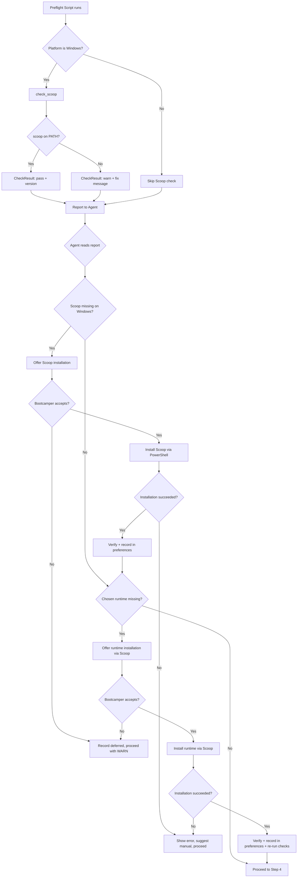

# Design Document: Windows Prerequisite Installation

## Overview

This feature adds proactive installation offers during the onboarding prerequisite check (Step 3) on Windows. Currently, when Scoop or language runtimes are missing, the preflight script emits a WARN verdict and defers installation to Module 2. This leaves bootcampers unaware of blockers until they've invested time in Module 1.

The design introduces two changes:

1. **Preflight script enhancement** — A new `check_scoop()` function detects the Scoop package manager on Windows and reports its status in the preflight report.
2. **Steering file enhancement** — New conditional logic in `onboarding-flow.md` Step 3 that reads the preflight report and offers installation of Scoop and missing runtimes when on Windows, recording outcomes in preferences.

The feature is strictly non-blocking: all offers are optional, failures never escalate the verdict, and declining defers to the existing Module 2 flow.

## Architecture



### Design Decisions

1. **Scoop detection lives in `preflight.py`** — It follows the existing pattern where each environment aspect has a dedicated check function. The steering file reads the report; it doesn't perform detection itself.

2. **Installation logic lives in the steering file** — The agent executes shell commands interactively. This keeps `preflight.py` a pure detection/reporting tool with no side effects.

3. **Command mapping lives in a new helper module** — A `scoop_install_commands()` function in `preflight.py` (or a small companion module) provides the mapping from runtime name to Scoop package and version command. This makes the mapping testable independently of agent behavior.

4. **Preferences recording uses existing YAML structure** — New keys are added to `config/bootcamp_preferences.yaml` alongside existing keys like `language` and `verbosity`.

## Components and Interfaces

### 1. `check_scoop()` — New function in `preflight.py`

```python
def check_scoop() -> list[CheckResult]:
    """Detect Scoop package manager on Windows.
    
    Returns an empty list on non-Windows platforms.
    On Windows, returns a single CheckResult:
      - pass with version if scoop is found
      - warn with fix message if scoop is not found
    """
```

Integrated into `CheckRunner.CHECK_SEQUENCE` between "Core Tools" and "Language Runtimes" (only on Windows).

### 2. `SCOOP_RUNTIME_COMMANDS` — Constant mapping in `preflight.py`

```python
SCOOP_RUNTIME_COMMANDS: dict[str, ScoopInstallInfo] = {
    "java": ScoopInstallInfo(
        bucket_add="scoop bucket add java",
        install_cmd="scoop install java/temurin-lts-jdk",
        verify_cmd="java --version",
    ),
    "dotnet": ScoopInstallInfo(
        bucket_add=None,
        install_cmd="scoop install dotnet-sdk",
        verify_cmd="dotnet --version",
    ),
    "rust": ScoopInstallInfo(
        bucket_add=None,
        install_cmd="scoop install rustup",
        verify_cmd="rustc --version",
    ),
    "nodejs": ScoopInstallInfo(
        bucket_add=None,
        install_cmd="scoop install nodejs-lts",
        verify_cmd="node --version",
    ),
}
```

### 3. `ScoopInstallInfo` — Dataclass in `preflight.py`

```python
@dataclasses.dataclass
class ScoopInstallInfo:
    """Installation metadata for a runtime via Scoop."""
    bucket_add: str | None   # Command to add required bucket, or None
    install_cmd: str         # The scoop install command
    verify_cmd: str          # Command to verify successful installation
```

### 4. Steering file additions — `onboarding-flow.md` Step 3

New conditional block after the preflight report is presented:

- If platform is Windows AND scoop check is "warn": offer Scoop installation
- If platform is Windows AND scoop is available AND chosen runtime check is "warn": offer runtime installation
- Record all outcomes in `config/bootcamp_preferences.yaml`

### 5. Preferences schema additions

New keys in `config/bootcamp_preferences.yaml`:

```yaml
# Added when Scoop is installed during onboarding
scoop_installed_during_onboarding: true

# Added when runtimes are installed during onboarding
runtimes_installed_during_onboarding:
  - name: java
    version: "21.0.3"

# Added when bootcamper declines installation
prerequisite_installation_deferred: true
```

## Data Models

### `ScoopInstallInfo` Dataclass

| Field | Type | Description |
|-------|------|-------------|
| `bucket_add` | `str \| None` | Scoop bucket command required before install (e.g., `scoop bucket add java`), or `None` if no bucket needed |
| `install_cmd` | `str` | The full `scoop install <package>` command |
| `verify_cmd` | `str` | Command to run after install to verify success (e.g., `java --version`) |

### `CheckResult` (existing, unchanged)

The existing `CheckResult` dataclass is reused for the Scoop check. No schema changes needed.

### Preferences additions

| Key | Type | When Written |
|-----|------|--------------|
| `scoop_installed_during_onboarding` | `bool` | After successful Scoop installation |
| `runtimes_installed_during_onboarding` | `list[dict]` | After each successful runtime installation |
| `prerequisite_installation_deferred` | `bool` | When bootcamper declines any installation offer |

Each entry in `runtimes_installed_during_onboarding` has:

- `name: str` — runtime identifier (e.g., "java", "dotnet", "rust", "nodejs")
- `version: str` — version string from the verify command output

## Correctness Properties

A property is a characteristic or behavior that should hold true across all valid executions of a system — essentially, a formal statement about what the system should do. Properties serve as the bridge between human-readable specifications and machine-verifiable correctness guarantees.

### Property 1: Scoop detection is platform-conditional and status-correct

*For any* platform string and scoop availability state, `check_scoop()` SHALL produce: (a) an empty list when platform is not `win32`, (b) a single CheckResult with status "pass" and version in message when platform is `win32` and scoop is on PATH, or (c) a single CheckResult with status "warn" and a non-empty fix message when platform is `win32` and scoop is not on PATH.

**Validates: Requirements 1.1, 1.2, 1.3, 1.4**

### Property 2: Installation command mapping produces valid sequences

*For any* supported runtime name, `SCOOP_RUNTIME_COMMANDS[name]` SHALL produce a `ScoopInstallInfo` where: (a) `install_cmd` is a non-empty string containing "scoop install", (b) `verify_cmd` is a non-empty string, and (c) if the runtime is "java", then `bucket_add` is a non-empty string containing "scoop bucket add java"; otherwise `bucket_add` may be `None`.

**Validates: Requirements 3.2, 6.1**

### Property 3: Preferences installation record round-trip

*For any* valid installation preferences record (containing `scoop_installed_during_onboarding`, `runtimes_installed_during_onboarding` with arbitrary runtime name/version pairs, and `prerequisite_installation_deferred`), serializing to YAML and deserializing SHALL preserve all field values exactly.

**Validates: Requirements 5.1, 5.2, 5.4**

### Property 4: Verdict invariance under installation outcomes

*For any* PreflightReport whose verdict is "WARN" (due to missing scoop or runtimes), the verdict SHALL remain "WARN" regardless of whether subsequent installation attempts succeed or fail — the verdict is computed solely from CheckResult statuses, not from installation side-effects.

**Validates: Requirements 4.2**

## Error Handling

| Scenario | Handling |
|----------|----------|
| `shutil.which("scoop")` raises unexpected exception | Catch broadly, return a "warn" CheckResult with "Could not check for Scoop" message |
| `scoop --version` times out or errors | Report "pass" (scoop exists) but with "version unknown" in message |
| Scoop installation command fails (non-zero exit) | Agent displays stderr, suggests manual install (`irm get.scoop.sh \| iex`), proceeds with WARN |
| Bucket addition fails | Agent displays error, suggests Adoptium website for Java, proceeds without blocking |
| Runtime installation fails | Agent displays error, suggests alternative install method, proceeds with WARN |
| Preferences file doesn't exist yet | Create it with the new keys only; don't overwrite existing content |
| Preferences file has unexpected format | Append new keys; don't fail onboarding over a malformed prefs file |

All error paths follow the principle: **never block onboarding, never escalate to FAIL**.

## Testing Strategy

### Property-Based Tests (Hypothesis)

The feature is suitable for property-based testing because the core logic involves:

- A pure detection function (`check_scoop()`) with clear input/output behavior
- A data mapping (`SCOOP_RUNTIME_COMMANDS`) with universal invariants
- Serialization round-trips (preferences YAML)
- Verdict computation (pure function of check statuses)

**Library:** Hypothesis (already used in the project)

**Configuration:** Minimum 100 iterations per property (`@settings(max_examples=100)`)

**Tag format:** `Feature: windows-prerequisite-installation, Property N: <title>`

Each correctness property maps to a single `@given`-decorated test method.

### Unit Tests (pytest)

- **Scoop check on actual win32 mock**: Verify `check_scoop()` integrates correctly with `CheckRunner` sequence
- **Scoop check skipped on Linux/macOS**: Verify no scoop result appears in full report on non-Windows
- **ScoopInstallInfo dataclass construction**: Verify all fields are accessible and typed correctly
- **Edge case: scoop command exists but --version fails**: Verify graceful degradation
- **Steering file content verification**: Verify `onboarding-flow.md` contains the installation offer logic, correct PowerShell command, and decline path

### Integration Tests

- **Full CheckRunner with scoop check**: Run `CheckRunner.run()` with mocked platform and verify scoop check appears in correct position
- **Preferences file write/read cycle**: Write installation records, read back, verify Module 2 skip logic can find them
