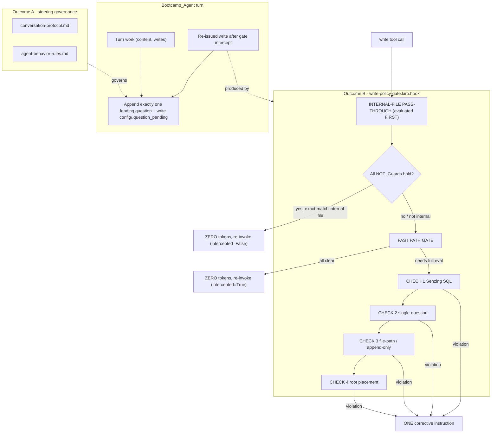

# Design Document

## Overview

The bootcamp's `write-policy-gate` `preToolUse` write hook intercepts nearly every config and progress write. When its checks pass, the SILENCE RULE produces zero tokens and the tool is re-invoked, which causes the `Bootcamp_Agent` to re-issue the identical write in a follow-up step. These intercept/retry cycles produce yielding turns that contain only tool activity — sometimes a bare `.` — with no visible `👉` leading question. The bootcamper perceives the flow as stalled and must prompt "ask the next leading question," breaking the bootcamp's core UX promise.

This design preserves *momentum* across the write gate along two complementary, independently shippable outcomes:

- **Outcome A — Leading-question guarantee (steering).** Every `Yielding_Turn` ends with exactly one `👉`-prefixed `Leading_Question`, including turns whose primary action was a write re-issued after a gate intercept. This is governed by two `auto`-inclusion steering files — `conversation-protocol.md` and `agent-behavior-rules.md` — so the behavior is enforced consistently across all modules without depending on any hook to supply the closing question.
- **Outcome B — Reduced intercept churn (hook).** The `write-policy-gate` INTERNAL-FILE PASS-THROUGH set is extended to include the two routine power-managed files named in the feedback (`config/data_sources.yaml`, `config/visualization_tracker.json`) so they pass silently on the first attempt — reusing the existing zero-token silent outcome with no new output strings — while every existing `NOT_Guard` safety condition and the hook's structural integrity are preserved.

### Research notes informing the design

The repository already contains a closely related, landed feature (`leading-question-continuity`) whose artifacts establish the conventions this design follows:

- The hook prompt at `senzing-bootcamp/hooks/write-policy-gate.kiro.hook` already carries an `INTERNAL-FILE PASS-THROUGH` block that enumerates the two target files and evaluates *before* the FAST PATH GATE, gated on four `NOT_Guard`s.
- The two steering files already contain an "Intercept-Recovery Continuity" section (`conversation-protocol.md`) and a corresponding paragraph in `agent-behavior-rules.md` (Rule 4), plus a zero-tolerance "One Question Rule."
- A reusable, pure **gate decision model** lives at `tests/gate_decision_model.py`. It loads the *live* hook prompt on every call and mirrors the prompt's branch logic, returning a `GateDecision(outcome, intercepted, category)`. This makes the hook's runtime behavior testable as a pure function.
- Shared test helpers (`tests/hook_test_helpers.py`) provide hook loading, schema validation, and Hypothesis strategies. The repo standard is pytest + Hypothesis, with property test classes annotated with the requirements they validate.

Consequently this design treats the work as *specifying and locking in* the target state with property-based tests rather than building net-new mechanisms. Where the live artifacts already satisfy a requirement, the design's tests assert and guard that state against drift.

## Architecture

The feature spans two layers that never share runtime state. Outcome A is enforced by agent-facing steering text; Outcome B is enforced by the hook prompt. The only coupling is conceptual: the closing-question obligation explicitly survives a gate intercept.



### Key architectural decisions

1. **Agent owns the closing question; the hook is a safety net only.** The leading-question guarantee is placed in steering, not in a hook, because the obligation must hold for *every* yielding turn regardless of which tools fired. Rationale: hooks fire on specific events; only the agent has whole-turn visibility. (Requirements 2.3, 3.3.)
2. **Pass-through is a pre-filter, not a new check.** The `INTERNAL-FILE PASS-THROUGH` block is evaluated before the FAST PATH GATE and reuses the identical zero-token silent outcome. It introduces no new output strings, so the four checks' corrective text is unchanged. Rationale: minimize blast radius and keep the safety surface byte-for-byte stable. (Requirements 4.4, 4.5, 5.x.)
3. **Exact-match membership.** The pass-through set is an explicit enumeration matched by exact path (plus the pre-existing member-scoped regexes and recap-log pattern). No partial/prefix/pattern over-match on the two new entries. Rationale: a broadened set must not silently pass an unintended path. (Requirement 4.6.)
4. **NOT-guards are evaluated before pass-through applies.** If any guard fails (Senzing SQL, `.question_pending`, feedback file, root placement), the write falls through to the four checks even for an enumerated internal file. Rationale: broadening the set must never weaken a safety check. (Requirements 5.1–5.5.)
5. **Live-artifact testing via a pure model.** Behavior is tested by driving the *on-disk* hook prompt through `tests/gate_decision_model.py`, and by asserting on the *on-disk* steering Markdown. Rationale: tests exercise the real shipped artifacts, not a copy, so drift fails the build. (All requirements.)

## Components and Interfaces

### Component 1: `conversation-protocol.md` (steering, Outcome A)

Auto-inclusion steering file governing turn-taking. Relevant sections this feature depends on / locks in:

- **End-of-Turn Protocol** — when a turn does not already end with a `👉` question, recap and append a contextual `👉` closing question; this is the agent's responsibility, "do not rely on hooks." (Requirements 2.1, 2.2, 2.3, 3.3.)
- **Intercept-Recovery Continuity** — a turn whose primary action was a write re-issued after a `write-policy-gate` intercept is not complete until exactly one `👉` leading question is appended and `config/.question_pending` is written; ending on bare tool activity or a bare `.` is a protocol violation. (Requirements 1.2, 1.3, 3.2.)
- **One Question Rule** — exactly one `👉` question per yielding turn; zero or two-plus is a violation. (Requirements 1.1, 3.4.)
- **Mandatory `question_pending`** — every `👉` question requires writing `config/.question_pending` with the structured format (type on line 1, text on subsequent lines). (Requirement 1.5.)

Interface (textual contract consumed by the agent): the file must contain explicit statements covering the four governance points in Requirement 3, with no wording that conflicts with `agent-behavior-rules.md`.

### Component 2: `agent-behavior-rules.md` (steering, Outcome A)

Auto-inclusion steering file of agent behavior rules. Relevant content:

- **Rule 4: Consistent Pointer Indicator** — prefix every input-requiring prompt with `👉`; module-close calls-to-action included.
- **Intercept paragraph appended to Rule 4** — a re-issued write following an intercept is work completed in the turn and still requires a closing `👉` call-to-action before yielding; cross-references "Intercept-Recovery Continuity" in `conversation-protocol.md`. (Requirements 3.2, 3.3, 3.5.)

Interface: the same four Requirement 3 governance statements must appear here too, phrased consistently with Component 1 (Requirement 3.5).

### Component 3: `write-policy-gate.kiro.hook` (hook, Outcome B)

A `preToolUse` hook with `toolTypes: ["write"]` and a `then.askAgent` prompt. The prompt is organized into rule-delimited sections (separated by `\n\n---\n\n`): the header + `INTERNAL-FILE PASS-THROUGH` block, the FAST PATH GATE, CHECK 1–4, then OUTPUT FORMAT.

The `INTERNAL-FILE PASS-THROUGH` block (the only part this feature edits) contains:

- An enumeration of routine power-managed internal files, including the two new exact entries `config/data_sources.yaml` and `config/visualization_tracker.json`.
- The four NOT-guard conditions that must all hold for the pass-through to apply.
- An instruction to "produce ZERO tokens and re-invoke the tool silently — the exact same silent outcome as the FAST PATH GATE. Introduce NO new output strings."

Interface (modeled by `gate_decision_model.gate(op, prompt)`): given a `WriteOperation(path, content, tool)` and the live prompt, returns a `GateDecision`:

- Exact-match enumerated internal file + all NOT-guards clean → `PASS_SILENT`, `intercepted=False`.
- Otherwise held (`intercepted=True`); fast path clear → `PASS_SILENT`; a violated check → `INTERCEPT_CORRECTIVE` with a `category` (`senzing_sql`, `single_question`, `feedback_append_only`, `external_path`, `root_placement`).

### Component 4: Test suite (pytest + Hypothesis)

Repo-level hook tests live in `tests/` (per project structure rules: tests that validate real hook files go in repo-root `tests/`, not `senzing-bootcamp/tests/`). They reuse:

- `tests/gate_decision_model.py` — pure decision model over the live prompt.
- `tests/hook_test_helpers.py` — hook loading, schema validation, Hypothesis strategies.

New/updated property modules follow the existing naming pattern (`test_*_properties.py`), use `@settings(max_examples=...)` (≥100 for the gate properties), and tag each class with the feature name and property number.

## Data Models

### `WriteOperation` (from `tests/gate_decision_model.py`)

```python
@dataclass(frozen=True)
class WriteOperation:
    path: str       # project-relative target path
    content: str    # full content (or edit payload) being written
    tool: str = "fs_write"   # one of: fs_write, fs_append, str_replace
```

### `GateDecision` (from `tests/gate_decision_model.py`)

```python
@dataclass(frozen=True)
class GateDecision:
    outcome: str            # "PASS_SILENT" | "INTERCEPT_CORRECTIVE"
    intercepted: bool       # True if the preToolUse hook held the write
    category: str | None    # corrective category when INTERCEPT_CORRECTIVE
```

### Pass-through set (conceptual model)

| Entry | Match kind | Source |
|---|---|---|
| `config/bootcamp_progress.json` | exact | pre-existing |
| `config/bootcamp_preferences.yaml` | exact | pre-existing |
| `config/data_sources.yaml` | exact | **added (Outcome B)** |
| `config/visualization_tracker.json` | exact | **added (Outcome B)** |
| `config/progress_{id}.json` | regex `^config/progress_[A-Za-z0-9_-]+\.json$` | pre-existing |
| `config/preferences_{id}.yaml` | regex `^config/preferences_[A-Za-z0-9_-]+\.yaml$` | pre-existing |
| `docs/progress/MODULE_*_COMPLETE.md` | regex `^docs/progress/MODULE_[^/]*_COMPLETE\.md$` | pre-existing |

### NOT-guards (all must hold for pass-through)

| Guard | Condition that must hold | On failure |
|---|---|---|
| Senzing SQL | content has no SQL pattern targeting a Senzing DB indicator | fall through to checks (`senzing_sql`) |
| Question-pending | path is not `config/.question_pending` | fall through (`single_question` if compound) |
| Feedback file | path is not `docs/feedback/SENZING_BOOTCAMP_POWER_FEEDBACK.md` | fall through (`feedback_append_only` for fs_write/str_replace) |
| Root placement | path is not a non-whitelisted blocked file in the project root | fall through (`root_placement`) |

### `config/.question_pending` (structured format)

```
<question_type>            # line 1: track_selection | module_transition | step_question | confirmation | choice
<full question text...>    # lines 2+: may be multi-line
```

## Correctness Properties

*A property is a characteristic or behavior that should hold true across all valid executions of a system — essentially, a formal statement about what the system should do. Properties serve as the bridge between human-readable specifications and machine-verifiable correctness guarantees.*

The hook behavior is testable as a pure function because `tests/gate_decision_model.py` loads the *live* hook prompt and deterministically mirrors its branch logic, returning a `GateDecision`. The steering governance is testable because the required statements are verifiable text in the on-disk Markdown. Acceptance criteria describing the `Bootcamp_Agent`'s runtime token output (Requirements 1.1–1.5, 2.1, 2.2) are not pure-function testable in this suite; their testable governance surrogate is Property 6 (steering governance), which the agent obeys at runtime.

### Property 1: New routine config files pass through silently on first attempt

*For any* write whose target path is exactly `config/data_sources.yaml` or exactly `config/visualization_tracker.json`, with NOT-guard-clean content and across any write tool (`fs_write`, `fs_append`, `str_replace`), the gate decision is `PASS_SILENT` with `intercepted = False` (zero output tokens, no intercept/retry), and the literal path appears in the INTERNAL-FILE PASS-THROUGH enumeration of `then.prompt`.

**Validates: Requirements 4.1, 4.2**

### Property 2: Existing pass-through entries still pass silently

*For any* write whose target path was already in the pass-through set before this change — the exact paths `config/bootcamp_progress.json` and `config/bootcamp_preferences.yaml`, any member-scoped `config/progress_{id}.json` or `config/preferences_{id}.yaml` instance, and any power-written `docs/progress/MODULE_*_COMPLETE.md` recap log — with NOT-guard-clean content and any write tool, the gate decision remains `PASS_SILENT` with `intercepted = False`. The extension regresses no previously silent path.

**Validates: Requirements 4.3**

### Property 3: Pass-through membership is exact-match only

*For any* path that is not exactly equal to a pass-through set entry — including adversarial near-misses such as a changed extension (`config/data_sources.yml`), an added suffix (`config/data_sources.yaml.bak`), an extra parent directory (`sub/config/data_sources.yaml`), or a case change (`config/DATA_SOURCES.yaml`) — the gate does NOT grant the silent pass-through; the write is held (`intercepted = True`) and routed to the four security checks.

**Validates: Requirements 4.6**

### Property 4: Any NOT-guard failure declines pass-through and yields exactly one matching corrective

*For any* write to a candidate pass-through path that violates exactly one NOT-guard — content containing Senzing SQL, a compound question written to `config/.question_pending`, an `fs_write`/`str_replace` overwrite of the append-only feedback file, or a blocked file type placed in the project root — the gate declines the silent pass-through, holds the write (`intercepted = True`), and returns `INTERCEPT_CORRECTIVE` with exactly one `category` matching the violated guard (`senzing_sql`, `single_question`, `feedback_append_only`, `root_placement`) and no additional content.

**Validates: Requirements 5.1, 5.2, 5.3, 5.4, 5.5, 6.5**

### Property 5: The pass-through extension introduces no new output strings and preserves the silent outcome

*For any* of the established baseline sections (FAST PATH GATE and CHECK 1–4), the corresponding section in the live prompt is byte-for-byte identical to the captured baseline, and the INTERNAL-FILE PASS-THROUGH block adds no new corrective/STOP marker of its own; consequently any clean write that is held by the gate (a non-pass-through write passing all four checks) results in `PASS_SILENT` with `intercepted = True` and `category = None`, the same silent outcome the pass-through reuses.

**Validates: Requirements 4.5, 6.4**

### Property 6: Steering governs the leading-question guarantee in both files without conflict

*For any* of the four required governance statements — (a) every yielding turn ends with exactly one leading question, (b) an intercept-reissued write turn ends with exactly one leading question, (c) the agent owns the closing question and does not depend on a hook, (d) the One Question Rule (exactly one per yielding turn; zero or two-plus violates) — and *for each* of the two governed steering files (`conversation-protocol.md`, `agent-behavior-rules.md`), the statement is present, and the two files do not contain conflicting wording.

**Validates: Requirements 1.1, 1.2, 1.3, 1.4, 1.5, 2.1, 2.2, 2.3, 3.1, 3.2, 3.3, 3.4, 3.5**

## Error Handling

The feature has no runtime error paths of its own; "errors" here are policy violations and artifact-integrity failures surfaced at hook-evaluation time, load time, or test time.

- **Policy violations (hook runtime).** When a NOT-guard fails or a check trips, the gate emits exactly one corrective instruction for that single violation and nothing else — no leading question, no acknowledgment, no narration (Requirement 6.5). The corrective text is the pre-existing CHECK 1–4 wording; the pass-through adds none. Per the OUTPUT FORMAT, forbidden strings (e.g., "Proceeding", "All checks pass") are never produced.
- **Malformed hook JSON (load time).** A `preToolUse` write gate with an unparseable prompt or empty `then.prompt` would silently stop enforcing security. The hook must remain well-formed JSON with non-empty required fields (Requirements 6.1–6.3); this is guarded by schema-conformance example tests that fail the build on violation.
- **Over-match / under-match (correctness failures).** An accidental prefix/pattern over-match would silently pass an unintended path (caught by Property 3); an accidental removal of a baseline entry would regress a previously silent path (caught by Property 2). Both fail tests rather than degrading at runtime.
- **Steering drift (governance failures).** If a required governance statement is removed from or contradicted across the two steering files, Property 6 fails, signaling that the leading-question guarantee is no longer enforced.
- **Edge inputs.** Empty content, very large content, non-ASCII content, and unusual-but-clean paths are handled by the gate's existing silent path; property generators exercise these to confirm they do not trip a NOT-guard or alter the outcome.

## Testing Strategy

The repo standard is **pytest + Hypothesis**, with property-based tests driving the *live* artifacts. Hook tests that validate the real hook file live in repo-root `tests/` (per project structure rules). All tests reuse `tests/gate_decision_model.py` and `tests/hook_test_helpers.py`.

### Property-based tests

Property-based testing IS appropriate here: the gate decision is a pure function of `(WriteOperation, prompt)` with a large input space (paths, content, tools), and the steering governance is a universal over files × statements. Configuration:

- A property-based testing library MUST be used (Hypothesis, already adopted) — not implemented from scratch.
- Each property test runs **minimum 100 iterations** (`@settings(max_examples=...)`, ≥100 for the gate properties; the existing related suites use 200).
- Each property test class is tagged with a comment referencing its design property, using the format: **Feature: write-gate-momentum-preservation, Property {number}: {property_text}**.
- Each correctness property is implemented by a **single** property-based test (one property → one test entry point), with `@example(...)` seeds for the adversarial/edge cases called out in each property.

| Property | Generators / inputs | Oracle |
|---|---|---|
| 1 — new paths pass silently | clean YAML/JSON content x 3 tools x the two new exact paths | `PASS_SILENT`, `intercepted=False`, path present in enumeration |
| 2 — existing entries preserved | clean content over exact + regex-instance entries x 3 tools | `PASS_SILENT`, `intercepted=False` |
| 3 — exact-match only | near-miss mutations (extension, suffix, parent, case) of exact entries | not pass-through; `intercepted=True` |
| 4 — NOT-guard routing | one of four violation kinds paired with expected category | `INTERCEPT_CORRECTIVE`, matching `category`, `intercepted=True` |
| 5 — no new output strings | sampled baseline section labels; benign probe text | live section equals baseline byte-for-byte; no new STOP marker; clean held write `PASS_SILENT`/`intercepted=True` |
| 6 — steering governance | cross-product of {2 governed files} x {4 required statements} | statement present in each file; no conflicting wording |

### Example / unit tests (non-PBT)

These cover deterministic, input-invariant checks that do not benefit from 100 iterations:

- **Hook schema conformance (Requirements 6.1, 6.2, 6.3):** load and parse the hook; assert `when.type == "preToolUse"`, `toolTypes == ["write"]`, presence and non-emptiness of `name`/`version`/`when`/`then`, and `then.type == "askAgent"` with a non-empty `then.prompt`.
- **Pass-through ordering (Requirement 4.4):** split the prompt into rule-delimited sections and assert the INTERNAL-FILE PASS-THROUGH block precedes the FAST PATH GATE section.
- **Enumeration diff (Requirements 4.1, 5.3):** assert the enumeration gained exactly the two new exact-match lines relative to the reconstructed baseline, with every prior entry preserved.
- **OUTPUT FORMAT integrity (Requirement 6.5):** assert the prompt's OUTPUT FORMAT section forbids extra content and lists the forbidden narration strings.

### CI integration

These tests run in the existing GitHub Actions pipeline (`validate-power.yml`) after `validate_power.py`, `measure_steering.py --check`, `validate_commonmark.py`, and `sync_hook_registry.py --verify`. Steering edits must respect the token budgets tracked in `steering-index.yaml` (verified by `measure_steering.py --check`), so any wording added for Requirement 3 must stay within budget.
