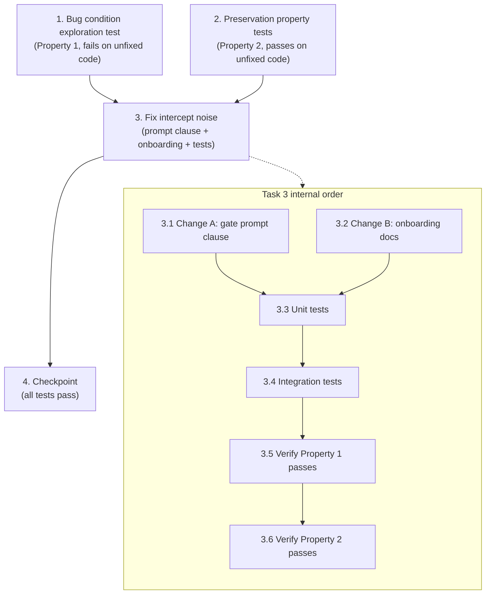

# Implementation Plan

## Overview

Tests in this plan operate on a **gate decision model**: a function that, given a
`WriteOperation` (`path`, `content`, `tool`), returns one of
`{ PASS_SILENT, INTERCEPT_CORRECTIVE }` plus a corrective category (mirroring the
prompt's four-check branch logic in `senzing-bootcamp/hooks/write-policy-gate.kiro.hook`).
Tests assert on this decision outcome and on the presence of the prompt's exclusion
clause and the onboarding documentation text. Per project conventions, hook tests that
validate the real hook file live in the repo-root `tests/` directory and use
pytest + Hypothesis.

This bugfix follows the exploratory bug-condition methodology: write the bug condition
exploration test (Property 1) and preservation tests (Property 2) BEFORE the fix, then
implement the two-part fix (gate prompt exclusion clause + onboarding documentation),
and finally re-run the same tests to confirm the bug is resolved with no regressions.

## Tasks

- [x] 1. Write bug condition exploration test
  - **Property 1: Bug Condition** - Power-Managed Internal Files Bypass Intercept Noise
  - **CRITICAL**: This test MUST FAIL on unfixed code - failure confirms the bug exists
  - **DO NOT attempt to fix the test or the code when it fails**
  - **NOTE**: This test encodes the expected behavior - it will validate the fix when it passes after implementation
  - **GOAL**: Surface counterexamples that demonstrate the gate has no internal-file pass-through, so power-managed internal writes are processed through normal interception (the noisy "Rejected" → "Accepted" pair)
  - **Scoped PBT Approach**: Generate power-managed internal-file writes with clean JSON/YAML/Markdown content. Anchor the property with concrete failing cases for reproducibility: `config/bootcamp_progress.json`, `config/bootcamp_preferences.yaml`, `config/progress_alice.json`, `config/preferences_alice.yaml`, and a power-written `docs/progress/MODULE_*_COMPLETE.md` log file
  - Build the gate decision model from the *unfixed* prompt in `senzing-bootcamp/hooks/write-policy-gate.kiro.hook`
  - For all `W` where `isBugCondition(W)` holds (power-managed internal file; NOT `.question_pending`; NOT the feedback file; contains NO Senzing SQL; NOT a root-blocked placement), assert `gate(W) = PASS_SILENT` and that no "Rejected" / corrective message is produced (from Bug Condition in design)
  - The test assertions should match Property 1 (Expected Behavior) from design — internal-file writes complete with zero output
  - Run test on UNFIXED code
  - **EXPECTED OUTCOME**: Test FAILS (this is correct - it proves the unfixed gate has no internal-file pass-through clause and still intercepts these writes)
  - Document counterexamples found (e.g., "config/bootcamp_progress.json is processed via normal interception with no pass-through clause, producing the Rejected → Accepted pair")
  - Mark task complete when test is written, run, and failure is documented
  - _Requirements: 1.1, 1.2, 2.1, 2.2_

- [x] 2. Write preservation property tests (BEFORE implementing fix)
  - **Property 2: Preservation** - Governed Writes Behave Identically
  - **IMPORTANT**: Follow observation-first methodology
  - Capture the UNFIXED gate decision model's outcomes for governed and clean inputs first, then assert the (later) fixed gate yields identical outcomes for all `NOT isBugCondition(W)` inputs
  - Observe on UNFIXED code and encode each preservation case (from Preservation Requirements in design):
    - SQL blocking: Senzing-SQL content (SELECT/INSERT/UPDATE/DELETE/CREATE TABLE/DROP TABLE/ALTER TABLE/PRAGMA targeting G2C.db, RES_ENT, OBS_ENT, SZ_, sz_dm_, etc.) on any path → INTERCEPT_CORRECTIVE with SDK redirect
    - Single-question rule: `config/.question_pending` with a compound/ambiguous question → INTERCEPT_CORRECTIVE (rewritten); confirms the internal-file exclusion does NOT shadow it
    - Feedback append-only: `fs_write` overwrite and `str_replace` edit of `docs/feedback/SENZING_BOOTCAMP_POWER_FEEDBACK.md` after creation → blocked; `fs_append` → passes
    - Root placement: root `main.py`, `data.jsonl`, non-whitelisted `.json` → INTERCEPT_CORRECTIVE (routed)
    - External-path redirect: `/tmp/...`, `%TEMP%`, `~/Downloads` or misrouted feedback content → redirected to project-relative equivalent
    - Clean-write fast path: ordinary `src/...` write → PASS_SILENT
    - `preToolUse` semantics: held-write then re-issue-of-identical-write preserved for every governed file (including `config/.question_pending`)
  - Write property-based tests (Hypothesis) generating non-bug-condition writes across the input domain (governed paths, SQL/non-SQL content, root-blocked placements, external paths, clean writes) plus near-miss generators (`config/.question_pending`, `config/notes.py`, root `progress.json`) and assert each is NOT excluded
  - Property-based testing generates many cases for stronger preservation guarantees
  - Run tests on UNFIXED code
  - **EXPECTED OUTCOME**: Tests PASS (this confirms the baseline governed/clean behavior to preserve)
  - Mark task complete when tests are written, run, and passing on unfixed code
  - _Requirements: 3.1, 3.2, 3.3, 3.4, 3.5, 3.6_

- [x] 3. Fix the write-policy-gate intercept noise on power-managed internal files

  - [x] 3.1 Implement Change A — add the INTERNAL-FILE PASS-THROUGH clause to the gate prompt
    - File: `senzing-bootcamp/hooks/write-policy-gate.kiro.hook` (`then.prompt`)
    - Insert an "INTERNAL-FILE PASS-THROUGH" clause at the very top of the prompt, before the existing FAST PATH GATE: if the target path is a routine power-managed internal file, produce ZERO tokens and re-invoke the tool silently (reuse the existing fast-path silent contract; introduce no new output strings)
    - Define the internal-file set precisely so the exclusion cannot over-match: `config/bootcamp_progress.json`, `config/bootcamp_preferences.yaml`, member-scoped `config/progress_{id}.json`, member-scoped `config/preferences_{id}.yaml`, and power-written session/recap log files (e.g., `docs/progress/MODULE_*_COMPLETE.md` and recap/journal logs the power appends to)
    - Guard the pass-through with explicit NOT clauses: applies ONLY when the path is NOT `config/.question_pending`, NOT the feedback file (`docs/feedback/SENZING_BOOTCAMP_POWER_FEEDBACK.md`), NOT a root-blocked placement, AND the content contains NO Senzing SQL
    - Preserve all four existing checks (SQL blocking, single-question, file-path/feedback append-only, root placement) and their corrective outputs verbatim; keep the SILENCE RULE / OUTPUT FORMAT intact
    - Keep the hook JSON schema valid (`name`, `version`, `when`, `then`) and retain `when.type = preToolUse` with `toolTypes: ["write"]` — do not remove or weaken the write hook
    - _Bug_Condition: isBugCondition(W) = isPowerManagedInternalFile(W.path) AND NOT endsWith(W.path, ".question_pending") AND NOT isFeedbackFile(W.path) AND NOT containsSenzingSql(W.content) AND NOT isRootBlockedPlacement(W.path)_
    - _Expected_Behavior: for all W where isBugCondition(W), gate'(W) = PASS_SILENT AND NOT produces_rejected_message (Property 1 / Fix Checking in design)_
    - _Preservation: for all W where NOT isBugCondition(W), gate'(W) = gate(W) — all genuine policy enforcement and preToolUse semantics unchanged (Property 2 / Preservation Requirements in design)_
    - _Requirements: 2.1, 2.2_

  - [x] 3.2 Implement Change B — document the intercept-retry cycle in onboarding
    - File: `senzing-bootcamp/steering/onboarding-flow.md` (and/or a short note in the relevant onboarding guide under `senzing-bootcamp/docs/guides/`)
    - Add a short "Why you may see Rejected/Accepted messages" note: the `write-policy-gate` safety check briefly holds writes for inspection; a held write shows as "Rejected" and the agent immediately re-issues it so it completes as "Accepted edits". Emphasize writes succeed on retry, no data is lost, and the cycle is expected and harmless
    - Set expectations after scoping: routine internal bookkeeping files no longer trigger the message, so remaining occurrences are rare and still harmless
    - _Expected_Behavior: onboarding documents that the intercept-retry cycle is expected and harmless (Property 3 in design)_
    - _Requirements: 2.3_

  - [x] 3.3 Add unit tests for the gate decision model and artifact integrity
    - Assert the fixed hook prompt contains the INTERNAL-FILE PASS-THROUGH clause and the explicit NOT-guards (`.question_pending`, feedback file, root-blocked placement, no Senzing SQL)
    - Assert the hook JSON remains schema-valid (`name`, `version`, `when`, `then`) and still declares `preToolUse` / `toolTypes: ["write"]`
    - Assert each internal-file path in the defined set maps to PASS_SILENT in the decision model
    - Assert `config/.question_pending` does NOT map to PASS_SILENT
    - Assert onboarding documentation contains the intercept-retry explanation (Property 3)
    - _Requirements: 2.1, 2.2, 2.3, 3.2, 3.6_

  - [x] 3.4 Add integration tests for checkpoint and mixed-session flows
    - Simulate a step-checkpoint flow that writes `config/bootcamp_progress.json` repeatedly and assert no corrective output is produced across the run
    - Simulate a mixed session (internal-file writes interleaved with a Senzing-SQL write, a `.question_pending` compound-question write, and a feedback overwrite) and assert internal writes pass silently while every governed write is still intercepted
    - Verify the onboarding flow renders the intercept-retry explanation where a bootcamper would encounter it early in onboarding
    - _Requirements: 2.1, 2.2, 2.3, 3.1, 3.2, 3.3, 3.4, 3.5, 3.6_

  - [x] 3.5 Verify bug condition exploration test now passes
    - **Property 1: Expected Behavior** - Power-Managed Internal Files Bypass Intercept Noise
    - **IMPORTANT**: Re-run the SAME test from task 1 - do NOT write a new test
    - The test from task 1 encodes the expected behavior (internal-file writes → PASS_SILENT, no "Rejected" message)
    - When this test passes, it confirms the expected behavior is satisfied
    - Run bug condition exploration test from step 1 against the fixed prompt/decision model
    - **EXPECTED OUTCOME**: Test PASSES (confirms the bug is fixed)
    - _Requirements: 2.1, 2.2 (Expected Behavior / Property 1 from design)_

  - [x] 3.6 Verify preservation tests still pass
    - **Property 2: Preservation** - Governed Writes Behave Identically
    - **IMPORTANT**: Re-run the SAME tests from task 2 - do NOT write new tests
    - Run preservation property tests from step 2 against the fixed gate
    - **EXPECTED OUTCOME**: Tests PASS (confirms no regressions — SQL blocking, single-question rule, feedback append-only, root placement, external-path redirect, and preToolUse semantics all unchanged)
    - Confirm all tests still pass after fix (no regressions)
    - _Requirements: 3.1, 3.2, 3.3, 3.4, 3.5, 3.6_

- [x] 4. Checkpoint - Ensure all tests pass
  - Run the full repo-level hook test suite plus the new tests (pytest + Hypothesis)
  - Ensure the bug condition test passes, all preservation tests pass, and unit/integration tests pass
  - Confirm CI checks remain green (`validate_power.py`, `validate_commonmark.py`, `sync_hook_registry.py --verify`, pytest)
  - Ensure all tests pass; ask the user if questions arise

## Task Dependency Graph



Execution waves (tasks within the same wave may run in parallel; later waves depend
on earlier waves):

```json
{
  "waves": [
    { "wave": 1, "tasks": ["1", "2"] },
    { "wave": 2, "tasks": ["3"] },
    { "wave": 3, "tasks": ["4"] }
  ]
}
```

Ordering rules:

- Tasks **1** and **2** are written and run against the UNFIXED code and must both
  precede task **3** (the exploration test confirms the bug; the preservation tests
  capture the baseline to preserve).
- Task **3** implements the fix and its sub-tasks: the two code changes (3.1, 3.2)
  precede the tests (3.3, 3.4), which precede the verification re-runs (3.5, 3.6).
- Task **4** (checkpoint) runs last, after the fix and all verification in task 3.

## Notes

- **Test-first ordering is mandatory.** Tasks 1 and 2 must be authored and executed
  before any fix code is written. Task 1 is expected to FAIL on unfixed code (this
  proves the bug); task 2 is expected to PASS on unfixed code (this captures the
  behavior to preserve).
- **Re-use, do not rewrite.** Sub-tasks 3.5 and 3.6 re-run the exact tests from
  tasks 1 and 2 — no new tests should be written for verification.
- **Test location.** Hook tests that validate the real hook file live in the
  repo-root `tests/` directory (per project structure rules), using pytest +
  Hypothesis.
- **Security constraints preserved.** The `preToolUse` write hook is never removed
  or weakened; only an additional silent pass-through for files that already pass
  every check is added. The hook JSON must keep its required
  `name`/`version`/`when`/`then` schema and retain `toolTypes: ["write"]`.
- **Out of scope.** Softening the IDE's "Rejected" label wording is an IDE-level
  concern and is not addressed by this power-side fix.
- **Property hover status.** PBT tasks use the `**Property N: Type**` format so the
  property test status can be tracked.
