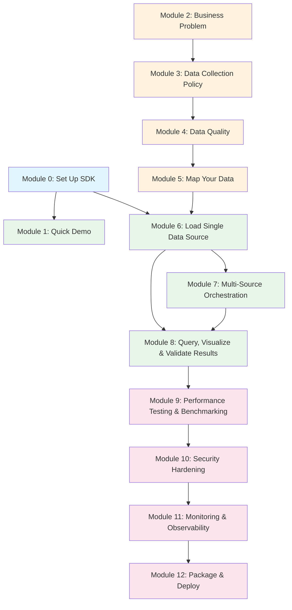

# Module Prerequisites

This diagram shows which modules depend on which. Use it to understand skip paths and what carries forward.

## Learning Paths

| Path | Modules | Color |
|------|---------|-------|
| A — Quick Demo | 0 → 1 | Blue → Green |
| B — Fast Track | 5 → 6 → 8 | Orange → Green |
| C — Complete Beginner | 2 → 3 → 4 → 5 → 6 → 8 | Orange → Green |
| D — Full Production | 0 → 1 → 2 → ... → 12 | All |

Module 0 (SDK Setup) is auto-inserted before any module that needs the SDK.

## Key Skip Points

- Have SGES data? Skip to Module 5
- SDK already installed? Module 0 auto-detects and skips
- Single source only? Skip Module 7
- Not deploying to production? Stop after Module 8
