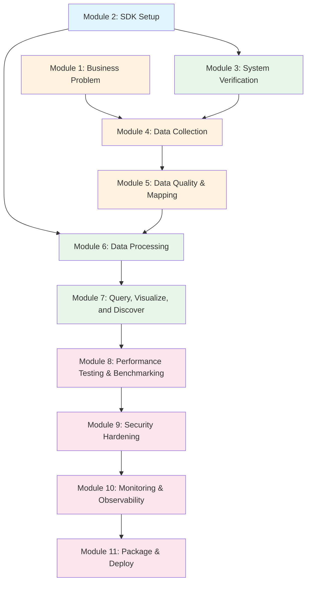

# Module Prerequisites

This diagram shows which modules depend on which. Use it to understand skip paths and what carries forward.

## Learning Paths

| Track | Modules | Color |
|-------|---------|-------|
| Core Bootcamp (recommended) | 1 → 2 → 3 → 4 → 5 → 6 → 7 | Orange → Blue → Green |
| Advanced Topics (not recommended for bootcamp) | 1 → 2 → 3 → 4 → 5 → 6 → 7 → 8 → 9 → 10 → 11 | All |

Module 2 (SDK Setup) is auto-inserted before any module that needs the SDK.

## Key Skip Points

- Have Senzing Generic Entity Specification (SGES) data? Skip ahead to Module 6
- SDK already installed? Module 2 auto-detects and skips
- Already verified your setup? Skip Module 3 with an explicit "skip verification" request
- Not deploying to production? Core Bootcamp ends after Module 7 (Modules 8-11 are Advanced Topics)
