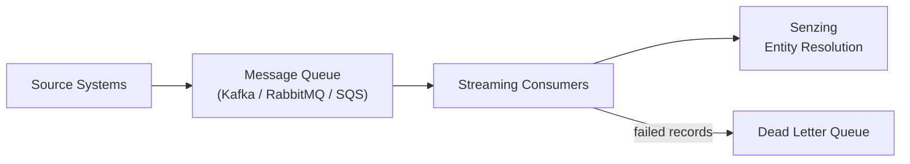
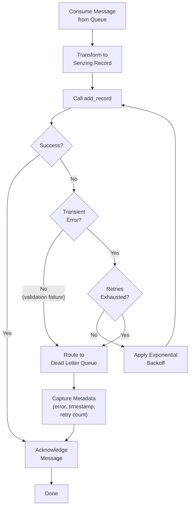

# Streaming Integration

In Module 6 you loaded records in a single batch, and the incremental loading guide showed how to add new records to an existing database as files arrive. Both approaches assume your application pulls data on its own schedule — reading files, calling `add_record`, and processing redo records in a loop you control. Production systems often work differently. Records flow continuously from source systems into message queues like Apache Kafka, RabbitMQ, or Amazon SQS, and your pipeline must consume and resolve them in real time without manual triggers or scheduled runs. That is streaming integration: connecting Senzing entity resolution to an event-driven architecture where records arrive as messages and are processed as fast as they appear. This guide covers the patterns you need to build that pipeline — consuming from queues, processing records through Senzing, handling backpressure when inbound rates exceed processing capacity, and managing errors so that individual failures do not stall the entire stream.



## Message Queue Consumption Patterns

Every streaming pipeline starts with a consumer — a component that reads messages from a queue and feeds them into your processing logic. The three queue technologies covered here each use a different model for how messages are delivered, tracked, and confirmed. Understanding these patterns lets you choose the right queue for your deployment and design a consumer that integrates cleanly with Senzing record processing.

The core loop is the same regardless of queue technology: read a message, transform it into a Senzing-compatible record, submit it for processing, and then acknowledge the message so the queue knows it has been handled. The differences lie in how each queue manages that acknowledgment and what happens when your consumer falls behind or fails mid-processing.

### Apache Kafka

Kafka organizes messages into topics, and each topic is split into partitions. Consumers belong to a consumer group, and Kafka assigns each partition to exactly one consumer within the group. This means two things for your pipeline: every record is processed by one consumer instance, and adding more consumers (up to the partition count) increases throughput by distributing partitions across them.

A Kafka consumer reads records by polling a partition at its current offset — a numeric position that tracks how far the consumer has progressed. After successfully processing a batch of records, the consumer commits the offset back to Kafka. This commit is the acknowledgment mechanism: it tells Kafka that all records up to that offset have been handled. If the consumer crashes before committing, Kafka redelivers records from the last committed offset when the consumer restarts.

The key design decision is when to commit offsets relative to Senzing processing:

- **Commit after processing**: The consumer calls `add_record` for each message, waits for confirmation, and then commits the offset. This guarantees no records are lost — a crash before the commit means the records are redelivered. The trade-off is that some records may be processed twice after a restart (at-least-once delivery).
- **Commit before processing**: The consumer commits the offset as soon as it reads the records, then processes them. This avoids duplicates but risks losing records if the consumer crashes between the commit and the `add_record` call.

For Senzing pipelines, committing after processing is the safer choice. Senzing handles duplicate records gracefully — re-loading a record with the same `RECORD_ID` replaces the existing record rather than creating a duplicate entity.

Partition rebalancing is another consideration. When a consumer joins or leaves the group, Kafka redistributes partitions among the remaining consumers. During a rebalance, processing pauses briefly. A well-designed consumer commits its current offsets before a rebalance starts and resumes from the newly assigned partitions once the rebalance completes.

### RabbitMQ

RabbitMQ uses a broker model where producers publish messages to exchanges, and exchanges route them to queues based on binding rules. Consumers subscribe to a queue and receive messages as the broker pushes them, or they can pull messages on demand.

Each consumer opens a channel to the broker and declares which queue it wants to consume from. When a message arrives, RabbitMQ delivers it to one consumer on that queue (round-robin by default when multiple consumers are subscribed). The message remains in an "unacknowledged" state on the broker until the consumer sends an explicit acknowledgment (ack). If the consumer disconnects without acknowledging, RabbitMQ requeues the message and delivers it to another consumer.

The prefetch count controls how many unacknowledged messages RabbitMQ will deliver to a single consumer at once. This is RabbitMQ's primary flow-control mechanism:

- A low prefetch count (such as 1) means the consumer processes one message at a time. This is simple and predictable but limits throughput.
- A higher prefetch count lets the consumer buffer several messages locally, reducing round-trip latency between the consumer and the broker. The trade-off is that if the consumer crashes, all unacknowledged messages in its buffer are requeued and redelivered.

For a Senzing streaming consumer, the pattern is: receive a message, transform it into a Senzing record, call `add_record`, and then acknowledge the message. If `add_record` fails with a transient error, the consumer can reject the message (with or without requeueing) or route it to a dead letter exchange for later inspection.

RabbitMQ also supports negative acknowledgments (nack), which tell the broker that processing failed. A nack can optionally requeue the message for another delivery attempt. Combining nack with a dead letter exchange gives you a clean separation between retryable failures and permanent failures.

### Amazon SQS

SQS is a fully managed queue service that uses a pull-based model. Consumers poll the queue to receive messages — SQS does not push messages to consumers. Each poll returns a batch of messages (up to 10), and the consumer processes them one at a time or in parallel.

When SQS delivers a message to a consumer, it does not remove the message from the queue. Instead, it makes the message invisible to other consumers for a period called the visibility timeout. During this window, the consumer is expected to process the message and then explicitly delete it from the queue. If the consumer does not delete the message before the visibility timeout expires, SQS makes the message visible again and another consumer (or the same one) can receive it.

This visibility-timeout model is SQS's acknowledgment mechanism:

- **Delete after processing**: The consumer calls `add_record`, confirms success, and then deletes the message from the queue. This is the standard pattern and provides at-least-once delivery — if the consumer crashes before deleting, the message reappears after the visibility timeout.
- **Extend the visibility timeout**: If processing takes longer than expected (for example, a large batch of records or a slow Senzing response), the consumer can extend the visibility timeout to prevent the message from being redelivered while it is still being processed.

SQS Standard queues deliver messages at least once and do not guarantee ordering. SQS FIFO queues guarantee ordering within a message group and provide exactly-once processing, but at lower throughput. For Senzing pipelines, Standard queues are typically sufficient because Senzing's `RECORD_ID`-based deduplication handles occasional redeliveries, and strict ordering is rarely required for entity resolution workloads.

SQS also supports a built-in dead letter queue mechanism. You configure a redrive policy on the source queue that specifies a maximum receive count — if a message is received more than that many times without being deleted, SQS automatically moves it to the designated dead letter queue. This provides automatic poison-message handling without any consumer-side logic.

### Message Transformation

The messages your consumer reads from a queue are rarely in the format Senzing expects. Source systems produce records in their own schemas — a CRM might send customer objects with `first_name` and `last_name` fields, a watchlist feed might use `fullName` and `address_line_1`, and a transaction system might embed person data inside a nested `parties` array. Before calling `add_record`, your consumer must transform each raw message into a Senzing-compatible JSON record with three essential components: `DATA_SOURCE`, `RECORD_ID`, and mapped attributes.

**Assigning DATA_SOURCE**

Every record submitted to Senzing needs a `DATA_SOURCE` value that identifies where the record came from. In a streaming pipeline, the data source is typically determined by the queue or topic the message arrived on, or by a field within the message itself. Common approaches:

- **Derive from the queue or topic name.** If each source system publishes to its own queue or Kafka topic (such as `crm-customers` or `watchlist-updates`), the consumer can map the topic name to a Senzing data source. A message from the `crm-customers` topic becomes `DATA_SOURCE: "CRM"`.
- **Extract from the message payload.** If multiple source systems publish to a shared queue, the message itself may contain a field indicating its origin — such as `source`, `system_id`, or `feed_name`. The consumer reads that field and maps it to the corresponding Senzing data source.
- **Use a static value.** If the consumer is dedicated to a single source system, the data source can be a fixed value configured at deployment time.

The key requirement is consistency: every record from the same source system must use the same `DATA_SOURCE` value across all loads, whether batch or streaming. Senzing uses the combination of `DATA_SOURCE` and `RECORD_ID` to uniquely identify a record, so changing the data source name would cause Senzing to treat existing records as new entries.

**Deriving RECORD_ID**

Each record also needs a `RECORD_ID` that is unique within its data source. The record ID is how Senzing tracks whether a record is new (add) or an update (replace). In a streaming context, the record ID usually comes from one of these sources:

- **A natural key in the message.** Most source systems include a primary key or unique identifier — a customer ID, account number, or case reference. This is the preferred approach because it preserves the link between the source system and the Senzing record.
- **A message-level identifier.** Some queue systems attach a unique message ID (such as a Kafka offset combined with partition, or an SQS message ID). These can serve as record IDs, but they tie the identity to the queue infrastructure rather than the source data, which makes correlation harder during audits or remediation.
- **A generated identifier.** If the message has no natural key, the consumer can generate a deterministic ID by hashing key fields from the record. This ensures the same source record always produces the same record ID, which is important for Senzing's replace-on-reload behavior.

Whatever strategy you choose, the record ID must be stable — the same source record should always produce the same `RECORD_ID`. If the ID changes between loads, Senzing treats the record as a new entry rather than an update to the existing one.

**Mapping Source Fields to Senzing Attributes**

After assigning `DATA_SOURCE` and `RECORD_ID`, the consumer maps the remaining source fields to Senzing entity attributes. Senzing uses a defined set of attribute names for entity resolution — `NAME_FULL`, `ADDR_FULL`, `PHONE_NUMBER`, `EMAIL_ADDRESS`, `DATE_OF_BIRTH`, and others. Your transformation logic must translate the source schema into these attribute names.

A typical transformation looks like this in pseudocode:

```text
raw_message = read_from_queue()

senzing_record = {
    "DATA_SOURCE": map_topic_to_data_source(raw_message.topic),
    "RECORD_ID":   raw_message.payload["customer_id"],
    "NAME_FULL":   raw_message.payload["first_name"] + " " + raw_message.payload["last_name"],
    "ADDR_FULL":   raw_message.payload["street"] + ", " + raw_message.payload["city"]
                   + ", " + raw_message.payload["state"] + " " + raw_message.payload["zip"],
    "PHONE_NUMBER": raw_message.payload["phone"],
    "EMAIL_ADDRESS": raw_message.payload["email"]
}

add_record(senzing_record)
acknowledge(raw_message)
```

A few practical considerations for the mapping step:

- **Composite fields.** Senzing accepts both composite attributes (like `NAME_FULL` for a complete name) and component attributes (like `NAME_FIRST`, `NAME_LAST`). If your source data has separate first and last name fields, you can either concatenate them into `NAME_FULL` or pass them as individual components. Either approach works — Senzing parses composite fields internally.
- **Missing fields.** Not every source record will have every attribute. A record without a phone number is still valid — Senzing resolves with whatever attributes are present. Your transformation should skip missing or empty fields rather than inserting blank values.
- **Extra fields.** Fields that do not map to Senzing attributes can be included in the record as custom attributes. Senzing stores them but does not use them for entity resolution. This is useful for carrying source metadata through the pipeline for downstream consumers.
- **Nested or array data.** If the source message contains nested objects or arrays (such as multiple addresses or a list of phone numbers), flatten them into separate Senzing attributes or submit multiple records — one per entity mention in the source message.

The transformation logic is the bridge between your source systems and Senzing's entity resolution engine. Keep it simple, make it testable, and version it alongside your consumer code so that schema changes in source systems are caught early rather than silently producing malformed records.

### Delivery Semantics

Every message queue offers a guarantee about how many times a message is delivered to a consumer. That guarantee — the delivery semantic — determines how your pipeline behaves when things go wrong: consumer crashes, network timeouts, or broker failovers. The two delivery semantics you will encounter are at-least-once and exactly-once, and they sit at different points on the trade-off between simplicity and correctness.

**At-least-once delivery** means the queue guarantees every message is delivered to a consumer at least one time, but it may be delivered more than once. This happens naturally when a consumer processes a message but crashes before acknowledging it — the queue has no record of successful processing, so it redelivers the message. Kafka's commit-after-processing pattern, RabbitMQ's ack-after-processing pattern, and SQS's delete-after-processing pattern all provide at-least-once delivery by default.

The trade-offs for at-least-once delivery:

- **Low complexity.** The consumer processes a message and then acknowledges it. No distributed transactions, no two-phase commits, no coordination between the queue and the processing system. This is the simplest pattern to implement and operate.
- **High reliability.** Because the queue only removes a message after explicit acknowledgment, no message is ever lost — even if consumers crash, restart, or lose network connectivity mid-processing.
- **Possible duplicates.** The same message may be processed more than once. If your processing logic is not idempotent, duplicates can cause incorrect results — double-counting, duplicate entries, or corrupted state.

**Exactly-once delivery** means each message is processed exactly one time, with no duplicates and no losses. Achieving this requires coordination between the queue and the processing system — typically through transactional writes where the message acknowledgment and the processing side effect happen atomically. Kafka supports exactly-once semantics through its transactional producer and consumer APIs. SQS FIFO queues provide exactly-once processing through message deduplication. RabbitMQ does not offer built-in exactly-once guarantees.

The trade-offs for exactly-once delivery:

- **Higher complexity.** Exactly-once requires transactional coordination between the queue and the downstream system. This adds configuration overhead, increases the surface area for bugs, and makes the pipeline harder to debug when something goes wrong.
- **Lower throughput.** Transactional guarantees require additional round trips and synchronization between components. This reduces the maximum message processing rate compared to at-least-once delivery.
- **Stronger correctness.** Each message is processed once and only once, which matters for systems where duplicate processing causes incorrect or irreversible side effects.

**How delivery semantics affect Senzing**

For Senzing pipelines, at-least-once delivery is the practical choice — and in most cases, the better one. The reason is Senzing's built-in handling of duplicate records: when you call `add_record` with a `DATA_SOURCE` and `RECORD_ID` that already exist, Senzing replaces the existing record rather than creating a duplicate entity. This replace-on-reload behavior makes `add_record` idempotent with respect to the same record content. If a consumer crashes and the queue redelivers a message, the consumer calls `add_record` again with the same `RECORD_ID`, and Senzing simply overwrites the previous version. The end result is identical to processing the message once.

This idempotency means the main risk of at-least-once delivery — duplicate processing causing incorrect state — does not apply to Senzing record loading. A redelivered message produces the same entity resolution outcome as the original delivery. You get the simplicity and reliability of at-least-once delivery without the correctness concerns that normally push teams toward exactly-once.

Exactly-once delivery still works with Senzing, but the added complexity rarely pays for itself. The transactional overhead reduces throughput, and the failure modes are harder to diagnose — all to prevent duplicate `add_record` calls that Senzing already handles gracefully. The scenarios where exactly-once adds value are narrow: pipelines where the same queue feeds both Senzing and a non-idempotent system (such as a billing ledger), or environments with strict audit requirements that mandate single-delivery proof at the queue level.

In practice, design your streaming pipeline around at-least-once delivery, use stable `RECORD_ID` values derived from natural keys in the source data, and let Senzing's replace-on-reload behavior absorb any redeliveries. This gives you a pipeline that is simple to build, easy to reason about, and resilient to the consumer failures that are inevitable in long-running production systems.

## Real-Time Record Processing Through Senzing

Once your consumer has read a message from the queue and transformed it into a Senzing-compatible record, the next step is submitting it for entity resolution. This is where the streaming pipeline connects to the same Senzing SDK you used in batch and incremental loading — the difference is that records arrive continuously rather than in a file you process on a schedule. Understanding the processing lifecycle helps you design a consumer that keeps entity resolution current without building up a backlog of deferred work.

> **Agent instruction:** Call `search_docs(query="add_record entity resolution redo processing lifecycle", version="current")` to retrieve the latest Senzing documentation on how `add_record` triggers entity resolution and generates redo records. Use the returned content to supplement the explanations below with any current SDK-specific details or behavioral changes.

### Processing Lifecycle

Every record that flows through your streaming pipeline follows the same lifecycle, regardless of which queue technology delivered it. The lifecycle has three phases: ingestion, resolution, and redo generation.

**Ingestion via `add_record`**

The consumer calls `add_record` with the transformed record — the same function used in batch loading (Module 6) and incremental loading. Senzing receives the record's `DATA_SOURCE`, `RECORD_ID`, and mapped attributes, and stores it in the repository. If a record with the same `DATA_SOURCE` and `RECORD_ID` already exists, Senzing replaces it — this is the same replace-on-reload behavior that makes at-least-once delivery safe for Senzing pipelines, as discussed in the Delivery Semantics section above.

In a streaming context, `add_record` is called once per message. The consumer reads a message, transforms it, calls `add_record`, and then acknowledges the message back to the queue. This tight loop — transform, ingest, acknowledge — is the heartbeat of the streaming pipeline.

**Entity resolution**

After Senzing stores the record, it immediately resolves the new record against all existing records in the repository. This resolution determines whether the new record creates a new entity, joins an existing entity, or causes two or more existing entities to merge. The resolution happens synchronously within the `add_record` call — when `add_record` returns, the new record has been fully resolved against the current state of the repository.

This synchronous resolution is what makes streaming integration powerful: every record is resolved the moment it arrives, so your entity resolution results are always as current as the latest message your consumer has processed. There is no separate resolution step to schedule or trigger — it happens inline as part of ingestion.

**Redo record generation**

Resolving a new record can change the relationships between existing entities. When Senzing merges entities or re-evaluates relationships as a result of the new record, it may determine that other records in the repository need to be re-evaluated too. These deferred re-evaluations are written to the redo queue as redo records — the same mechanism you encountered in batch and incremental loading.

In a streaming pipeline, redo records accumulate continuously as new records arrive and trigger entity changes. A single `add_record` call might generate zero redo records (if the new record creates a standalone entity with no matches) or several (if it causes a merge that affects records across multiple existing entities). The volume of redo work depends on how interconnected the incoming data is with what is already in the repository.

The redo queue does not process itself. Your pipeline needs a strategy for draining redo records — whether that is processing them inline after each `add_record`, batching them periodically, or running a separate consumer dedicated to redo work. The next subsection covers these approaches in detail.

### The Streaming Processing Loop

Putting the lifecycle together, a streaming consumer follows this conceptual loop:

```text
while consuming from queue:
    message = read_next_message()
    record  = transform_to_senzing_record(message)

    add_record(record.data_source, record.record_id, record.json_data)
    # At this point:
    #   - The record is stored in the Senzing repository
    #   - Entity resolution has run against all existing records
    #   - Any affected entities have generated redo records

    acknowledge(message)
```

The loop is deliberately simple. Each iteration processes one message end-to-end: read, transform, ingest (with resolution), and acknowledge. Keeping the loop tight means the consumer makes steady progress through the queue, and the acknowledgment only happens after Senzing has fully processed the record. If the consumer crashes between `add_record` and `acknowledge`, the queue redelivers the message and Senzing's replace-on-reload behavior ensures the re-processing produces the same result.

### Redo Processing in Streaming Pipelines

The processing lifecycle section above described how `add_record` can generate redo records — deferred re-evaluations that Senzing queues when resolving a new record changes relationships among existing entities. In batch loading, you typically drain the redo queue in a loop after all records have been loaded. In a streaming pipeline, records never stop arriving, so there is no natural pause where you can "catch up" on redo work. You need a strategy that keeps redo processing moving alongside ongoing ingestion.

There are two main approaches: processing redo records inline within the same consumer that calls `add_record`, or running a dedicated redo consumer that drains the redo queue independently. Both work, and the right choice depends on your throughput requirements and how current you need entity resolution results to be.

> **Agent instruction:** Call `search_docs(query="redo record processing get_redo_record process_redo_record streaming", version="current")` to retrieve the latest Senzing documentation on redo processing APIs and recommended patterns. Use the returned content to confirm the current function names and any behavioral details that supplement the explanations below.

**Inline redo processing**

In this approach, the streaming consumer handles redo records as part of its main loop. After calling `add_record` for each message (or after a small batch of messages), the consumer checks the redo queue and processes any pending redo records before moving on to the next message. The conceptual pattern looks like this:

```text
while consuming from queue:
    message = read_next_message()
    record  = transform_to_senzing_record(message)

    add_record(record.data_source, record.record_id, record.json_data)

    # Drain pending redo records before continuing
    while has_redo_records():
        redo = get_next_redo_record()
        process_redo_record(redo)

    acknowledge(message)
```

A variation processes redo records in bounded batches rather than draining the entire queue each iteration. This prevents a burst of redo work from stalling the main ingestion loop for too long:

```text
while consuming from queue:
    message = read_next_message()
    record  = transform_to_senzing_record(message)

    add_record(record.data_source, record.record_id, record.json_data)

    # Process up to N redo records per iteration
    for i in range(REDO_BATCH_SIZE):
        if not has_redo_records():
            break
        redo = get_next_redo_record()
        process_redo_record(redo)

    acknowledge(message)
```

The trade-offs of inline redo processing:

- **Entity resolution stays current.** Because redo records are processed alongside new records, the relationships in the repository reflect the latest state at all times. There is no window where redo work is deferred and entity resolution results are stale.
- **Ingestion throughput decreases.** Every redo record processed in the main loop is time not spent consuming the next message from the queue. If a single `add_record` triggers many redo records — common when a new record merges several existing entities — the consumer pauses on redo work while the queue continues to fill. This can cause consumer lag to grow during bursts of highly connected data.
- **Simpler deployment.** There is only one consumer process to manage. No coordination is needed between separate ingestion and redo components, and there is no risk of the redo consumer falling behind or being forgotten.

Inline processing works well when inbound message rates are moderate and the data is not heavily interconnected — meaning each `add_record` generates few redo records on average. It is also a good starting point for pipelines where operational simplicity matters more than peak throughput.

**Dedicated redo consumer**

In this approach, the streaming consumer that calls `add_record` does not touch the redo queue at all. Instead, a separate process or thread runs independently, polling the redo queue and processing redo records on its own schedule. The two components share the same Senzing repository but operate on different workloads:

```text
# Ingestion consumer (reads from message queue)
while consuming from queue:
    message = read_next_message()
    record  = transform_to_senzing_record(message)

    add_record(record.data_source, record.record_id, record.json_data)
    acknowledge(message)

# Redo consumer (runs as a separate process or thread)
while running:
    if has_redo_records():
        redo = get_next_redo_record()
        process_redo_record(redo)
    else:
        sleep(REDO_POLL_INTERVAL)
```

The trade-offs of a dedicated redo consumer:

- **Ingestion throughput is unaffected.** The main consumer loop stays tight — read, transform, ingest, acknowledge — with no redo work slowing it down. This maximizes the rate at which new records are consumed from the queue.
- **Redo processing may lag behind.** Because the redo consumer runs independently, it processes redo records at its own pace. If new records generate redo work faster than the redo consumer can drain it, the redo queue grows and entity resolution results become temporarily stale. The lag is eventually resolved as the redo consumer catches up, but there is a window where relationships in the repository do not fully reflect the latest data.
- **More moving parts.** You now have two components to deploy, monitor, and scale. The redo consumer needs its own health checks, error handling, and restart logic. If the redo consumer stops without anyone noticing, the redo queue grows indefinitely and entity resolution quality degrades silently.
- **Independent scaling.** The redo consumer can be scaled separately from the ingestion consumer. If redo work is the bottleneck, you can add redo processing capacity without changing the ingestion side. This flexibility is valuable in pipelines with high data interconnectedness where redo volume is unpredictable.

A dedicated redo consumer is the better choice when ingestion throughput is the priority and you can tolerate a short delay before redo records are resolved. It is also the natural fit when you are already running multiple ingestion consumer instances (covered in the concurrency section below) — adding a separate redo consumer keeps the architecture clean rather than having every ingestion instance compete to drain the same redo queue.

**Choosing an approach**

The decision comes down to two questions: how fast do records arrive, and how current do entity resolution results need to be?

- If your inbound message rate is low enough that the consumer has idle time between messages, inline redo processing adds negligible latency and keeps the deployment simple.
- If your pipeline needs to sustain high ingestion throughput and you can accept a short delay before redo records are resolved, a dedicated redo consumer decouples the two workloads and lets each scale independently.
- If you start with inline processing and later find that redo work is causing consumer lag, migrating to a dedicated redo consumer is straightforward — you remove the redo loop from the ingestion consumer and deploy the redo consumer as a separate process.

In practice, many production pipelines start with inline redo processing for simplicity and move to a dedicated consumer when throughput demands require it. Either way, the important thing is that redo records are processed — leaving the redo queue unattended causes entity resolution quality to degrade over time as relationship changes go unresolved.

### Concurrency Considerations

The examples above show a single consumer processing records one at a time. That works for low-volume pipelines, but production deployments often need to process thousands of records per second. The way to get there is concurrency — running multiple consumer threads or multiple consumer instances that call `add_record` in parallel. Senzing supports this, but the database backing the repository determines how far you can scale.

> **Agent instruction:** Call `find_examples(query="streaming consumer parallel concurrency", version="current")` to locate working code from indexed Senzing repositories that demonstrate multi-threaded or multi-instance streaming consumer patterns.

**Why PostgreSQL is required for multi-instance concurrency**

Senzing stores its entity resolution repository in a database. The two supported options are SQLite and PostgreSQL, and they have fundamentally different concurrency characteristics:

- **SQLite** is a file-based database that supports only one writer at a time. Multiple threads or processes can read concurrently, but writes are serialized — only one `add_record` call can modify the database at any given moment. This means running multiple consumer threads against a SQLite-backed repository does not improve write throughput. The threads simply queue up waiting for the write lock. SQLite is fine for development, testing, and single-threaded pipelines, but it is a bottleneck for concurrent streaming workloads.
- **PostgreSQL** is a client-server database designed for concurrent access. Multiple connections can write simultaneously, and PostgreSQL's MVCC (Multi-Version Concurrency Control) mechanism handles the isolation between them. This means multiple consumer threads or entirely separate consumer processes can call `add_record` in parallel, each holding its own database connection, and PostgreSQL coordinates the writes without serializing them into a single queue.

If your streaming pipeline needs to process records concurrently — whether through multiple threads in one process or multiple consumer instances across different machines — PostgreSQL is the required database backend. Attempting to scale concurrency on SQLite will not produce the throughput gains you expect.

**Multiple consumer threads within a single process**

The simplest form of concurrency is running several threads inside one consumer process, each pulling messages from the queue and calling `add_record` independently. The conceptual pattern looks like this:

```text
# Each thread runs this loop independently
def consumer_thread(thread_id):
    while consuming from queue:
        message = read_next_message()
        record  = transform_to_senzing_record(message)

        add_record(record.data_source, record.record_id, record.json_data)
        acknowledge(message)

# Start N threads against the same Senzing engine and PostgreSQL repository
for i in range(NUM_THREADS):
    start_thread(consumer_thread, thread_id=i)
```

Each thread maintains its own Senzing engine context and database connection. The threads share the same repository, so entity resolution results from one thread are immediately visible to the others. This is the easiest way to increase throughput without changing your deployment topology — you scale within a single process by adding threads.

The practical limit on thread count depends on the machine's CPU and memory, the PostgreSQL connection pool size, and the complexity of the entity resolution workload. Adding threads improves throughput up to a point, after which contention on shared resources (CPU, database connections, Senzing internal locks) causes diminishing returns.

**Multiple consumer instances across separate processes or machines**

For higher throughput or fault tolerance, you can run multiple consumer instances as separate processes — potentially on different machines — all pointing at the same PostgreSQL-backed Senzing repository. Each instance is an independent consumer that reads from the queue, transforms messages, and calls `add_record` against the shared database.

This is where queue-level parallelism becomes important:

- **Kafka partitions.** Kafka distributes partitions across consumers in the same consumer group. If your topic has 12 partitions and you run 4 consumer instances, each instance is assigned 3 partitions and processes them independently. Adding more instances (up to the partition count) increases throughput linearly. Beyond the partition count, extra instances sit idle.
- **RabbitMQ multiple consumers.** Multiple consumers can subscribe to the same RabbitMQ queue. The broker distributes messages round-robin across connected consumers, with the prefetch count controlling how many messages each consumer buffers locally. Adding consumers increases throughput as long as the broker and the downstream database can handle the load.
- **SQS concurrent pollers.** Multiple consumer instances can poll the same SQS queue simultaneously. SQS distributes messages across pollers automatically — each `ReceiveMessage` call returns a batch of messages that are invisible to other pollers for the duration of the visibility timeout. Scaling is straightforward: add more polling instances to increase throughput.

In all three cases, the queue technology handles message distribution so that each record is processed by exactly one consumer instance. The consumer instances do not need to coordinate with each other — they each maintain their own connection to the PostgreSQL database and call `add_record` independently.

**How Senzing handles concurrent writes to the same entity**

When multiple consumer threads or instances process records in parallel, two records that resolve to the same entity can arrive at roughly the same time. Senzing handles this through internal locking at the entity level within the database. If two `add_record` calls affect the same entity simultaneously, one completes first and the other waits briefly for the lock, then proceeds with the updated entity state. The result is the same as if the two records had been processed sequentially — no data is lost or corrupted.

This entity-level locking means concurrency works correctly without any application-side coordination. You do not need to partition records by entity, route related records to the same consumer, or implement your own locking. Senzing and PostgreSQL handle the serialization of conflicting writes transparently. The only observable effect is that heavily overlapping entities — where many incoming records resolve to the same entity — may see reduced parallelism for those specific records as threads wait for entity locks. In practice, this is rarely a bottleneck because most incoming records resolve to different entities and proceed without contention.

**Scaling guidelines**

A few practical considerations when scaling consumer concurrency:

- **Start with threads, then scale to instances.** Multi-threaded consumption within a single process is simpler to deploy and monitor. Move to multiple instances when a single machine cannot keep up or when you need fault tolerance across hosts.
- **Match consumer count to queue parallelism.** For Kafka, the number of useful consumer instances is bounded by the partition count. For RabbitMQ and SQS, the queue itself is not the bottleneck — the database and Senzing processing capacity are.
- **Monitor database connection usage.** Each consumer thread or instance holds a database connection. PostgreSQL has a maximum connection limit, and exceeding it causes new connections to be rejected. Size your connection pool and PostgreSQL `max_connections` setting to accommodate the total number of concurrent consumers.
- **Separate redo processing from ingestion.** When running multiple ingestion consumers, use a dedicated redo consumer (as described in the previous subsection) rather than having each ingestion instance process redo records. This avoids contention on the redo queue and keeps the ingestion path focused on throughput.

## Backpressure Handling

In a streaming pipeline, records arrive at whatever rate the source systems produce them. Senzing processes each record through entity resolution — comparing it against every existing record in the repository — and that work takes time. When records arrive faster than Senzing can resolve them, the unprocessed messages pile up. This is backpressure: the downstream system (Senzing) cannot keep pace with the upstream flow (the message queue), and the gap between what has been produced and what has been consumed grows over time. Left unmanaged, backpressure leads to unbounded queue growth, increasing consumer lag, stale entity resolution results, and eventually resource exhaustion on the broker or the consumer hosts.

Backpressure is not a bug — it is a normal operating condition in any pipeline where producers and consumers run at different speeds. Burst traffic, batch imports from upstream systems, or a temporary slowdown in Senzing processing (due to database maintenance or a spike in entity complexity) can all trigger it. The goal is not to eliminate backpressure entirely but to design your pipeline so that it absorbs temporary imbalances gracefully and recovers without data loss or operator intervention.

The three strategies below address backpressure at different layers of the pipeline: at the consumer, at the queue, and at the deployment level. They are complementary — most production pipelines use some combination of all three.

### Consumer-Side Rate Limiting

The most direct way to handle backpressure is to slow the consumer down. Instead of pulling messages from the queue as fast as the network allows, the consumer limits its own consumption rate to match what Senzing can actually process. This keeps the consumer from overwhelming the Senzing engine and the underlying database with more concurrent `add_record` calls than they can handle.

Rate limiting at the consumer level takes several forms:

- **Fixed-rate throttling.** The consumer enforces a maximum number of records per second, regardless of how fast the queue can deliver them. This is the simplest approach — you measure Senzing's sustainable processing rate during testing, set the consumer's rate limit slightly below that, and the consumer never outpaces the engine. The downside is that a fixed rate does not adapt to changing conditions. If Senzing processing slows down (due to increased entity complexity or database load), the fixed rate may still be too high. If Senzing has spare capacity, the fixed rate leaves throughput on the table.

- **Prefetch and batch size controls.** Rather than throttling at the application level, you can limit how many messages the consumer pulls from the queue at once. In RabbitMQ, this is the prefetch count — setting it to a low value means the consumer only has a few messages in flight at any time. In Kafka, the `max.poll.records` configuration controls how many records a single poll returns. In SQS, the `MaxNumberOfMessages` parameter on `ReceiveMessage` limits the batch size. These controls do not set an explicit rate, but they bound the amount of work the consumer takes on before it must finish processing and come back for more.

- **Adaptive throttling.** A more sophisticated approach monitors Senzing's processing latency or the consumer's own throughput and adjusts the consumption rate dynamically. If `add_record` calls start taking longer — a signal that Senzing or the database is under load — the consumer reduces its polling frequency or increases the delay between batches. When latency drops back to normal, the consumer speeds up again. This requires more instrumentation but keeps the consumer running as fast as Senzing can handle at any given moment.

The common thread across these approaches is that the consumer takes responsibility for not overwhelming the downstream system. The queue continues to buffer messages at whatever rate producers send them, and the consumer drains the queue at a pace Senzing can sustain. Consumer lag may increase during bursts, but the pipeline remains stable and recovers once the burst subsides.

Consumer-side rate limiting is especially important when running multiple consumer threads or instances. Each thread or instance independently calls `add_record`, and the aggregate load on Senzing and PostgreSQL is the sum of all concurrent consumers. Without rate limiting, scaling from 4 consumer threads to 16 can quadruple the database connection pressure and push Senzing past its sustainable throughput — causing all consumers to slow down due to contention rather than just the ones that were added.

### Queue-Level Buffering with Retention Policies

The message queue itself is a natural buffer between producers and consumers. When consumers fall behind, unprocessed messages accumulate in the queue rather than being lost. This buffering is one of the core reasons to use a message queue in the first place — it decouples the producer's rate from the consumer's rate and absorbs temporary imbalances without requiring either side to change behavior.

However, buffering without limits is dangerous. If the consumer falls behind for an extended period — hours or days rather than minutes — the queue grows until it exhausts disk space on the broker, triggers out-of-memory conditions, or hits a platform-imposed size limit. Retention policies put a ceiling on how much data the queue holds and define what happens to messages that exceed that ceiling.

Each queue technology handles retention differently:

- **Kafka** uses time-based and size-based retention at the topic level. You configure `retention.ms` (how long messages are kept) and `retention.bytes` (the maximum size of a partition's log). Messages older than the retention period or exceeding the size limit are deleted regardless of whether a consumer has read them. For a Senzing pipeline, set retention long enough to cover your worst-case consumer downtime — if your consumer might be offline for maintenance for up to 24 hours, a 48-hour retention period gives you a safety margin. Size-based retention acts as a secondary safeguard: even if the time-based policy has not expired, Kafka will not let a partition grow beyond the configured size.

- **RabbitMQ** supports queue length limits and message TTL (time-to-live). A queue length limit caps the number of messages in the queue — when the limit is reached, RabbitMQ either drops the oldest messages (head drop) or rejects new messages from producers (reject publish), depending on the overflow behavior you configure. Message TTL sets a per-message or per-queue expiration time — messages that sit in the queue longer than the TTL are discarded or routed to a dead letter exchange. For a Senzing pipeline, combining a queue length limit with a dead letter exchange gives you bounded growth with a safety net: messages that cannot be processed in time are moved to the dead letter queue for later inspection rather than silently dropped.

- **SQS** has a built-in message retention period, configurable from 1 minute to 14 days (default is 4 days). Messages that remain in the queue longer than the retention period are automatically deleted. SQS also enforces a maximum queue size implicitly through its pricing and throughput model — there is no hard cap on queue depth, but the cost of storing millions of unprocessed messages and the operational signal of a growing queue act as practical limits. For a Senzing pipeline, the default 4-day retention is usually sufficient, but you should monitor queue depth and treat a growing backlog as an alert condition rather than waiting for messages to age out.

The key principle is that retention policies turn unbounded queue growth into a bounded, predictable behavior. You decide in advance how much buffering your pipeline needs, configure the queue accordingly, and monitor for conditions where the buffer is filling up faster than the consumer can drain it. A queue that is consistently near its retention limit is a signal that the consumer needs more capacity — either through rate-limiting adjustments, additional consumer instances, or investigation into why Senzing processing has slowed down.

Retention policies also interact with your delivery semantics. With at-least-once delivery, a message that expires before the consumer reads it is lost — the queue deletes it, and the consumer never sees it. For Senzing pipelines where data completeness matters, this means your retention period must be long enough to cover any realistic consumer outage. If you cannot tolerate any message loss, set retention conservatively high and pair it with alerting on queue depth so that you can intervene before messages start expiring.

### Horizontal Scaling of Consumer Instances

When a single consumer cannot keep up with the inbound message rate — even with rate limiting tuned and the queue absorbing bursts — the next step is to add more consumers. Horizontal scaling increases the aggregate throughput of your pipeline by distributing the message processing workload across multiple consumer instances, each running its own `add_record` calls against the shared Senzing repository.

This strategy builds directly on the concurrency model described in the previous section. Each consumer instance is an independent process (potentially on a separate machine) that reads from the queue, transforms messages, and submits records to Senzing through its own database connection. The queue technology handles message distribution so that each message is processed by exactly one instance:

- In **Kafka**, adding consumer instances to the same consumer group causes Kafka to redistribute partitions across the larger group. If your topic has 12 partitions and you scale from 2 instances to 6, each instance goes from handling 6 partitions to handling 2 — cutting the per-instance workload and increasing aggregate throughput. The upper bound is the partition count: more instances than partitions means some instances sit idle.
- In **RabbitMQ**, additional consumers subscribing to the same queue receive messages via round-robin distribution. There is no partition-based limit — you can add consumers as long as the broker and the database can handle the load.
- In **SQS**, additional polling instances receive messages from the same queue automatically. SQS distributes messages across concurrent `ReceiveMessage` calls, and there is no configuration needed to enable multi-instance consumption.

Horizontal scaling is effective, but it is not free. Each additional consumer instance adds load to the systems downstream of the queue:

- **Database connection pressure.** Every consumer instance maintains one or more connections to the PostgreSQL database backing the Senzing repository. Scaling from 4 instances to 16 quadruples the connection count. PostgreSQL has a finite connection limit (`max_connections`), and exceeding it causes new connections to be rejected. Size your connection pool and PostgreSQL configuration to accommodate the total number of consumer instances you plan to run.

- **Entity-level contention.** As described in the concurrency section, Senzing uses entity-level locking when multiple `add_record` calls affect the same entity simultaneously. With more consumer instances processing records in parallel, the probability of two instances touching the same entity at the same time increases. For most workloads this is not a bottleneck — records typically resolve to different entities — but pipelines with highly interconnected data (where many incoming records merge into a small number of entities) may see diminishing returns from additional instances as threads spend more time waiting for entity locks.

- **Redo volume.** More consumer instances means more records ingested per unit of time, which means more redo records generated per unit of time. If you are using a dedicated redo consumer, it needs to keep pace with the increased redo volume. Scaling ingestion consumers without also scaling redo processing can cause the redo queue to grow, leading to stale entity resolution results.

The practical approach to horizontal scaling is incremental. Start with a small number of consumer instances, monitor throughput and consumer lag, and add instances until the lag stabilizes at an acceptable level. If adding instances stops improving throughput — because the database or Senzing processing is the bottleneck rather than the consumer count — further scaling requires addressing those downstream constraints (larger database instance, more CPU for Senzing processing, or partitioning the workload across separate Senzing repositories).

Horizontal scaling works best in combination with the other two strategies. Rate limiting on each consumer instance prevents any single instance from overwhelming the database. Queue-level buffering absorbs bursts while you scale up. Together, the three strategies give your pipeline the ability to handle sustained high throughput, absorb traffic spikes, and degrade gracefully when processing capacity is temporarily reduced.

### Detecting Backpressure

The strategies above — rate limiting, queue buffering, and horizontal scaling — are responses to backpressure. But before you can respond, you need to know backpressure is happening. A pipeline under backpressure does not raise an exception or print a warning. It degrades quietly: entity resolution results fall further behind reality, queues grow, and by the time someone notices, the gap between produced and consumed messages may be hours or days wide. Detecting backpressure early requires watching three observable metrics that together give you a complete picture of where the pipeline is falling behind and how fast the problem is growing.

**Consumer lag**

Consumer lag is the difference between the latest message produced to the queue and the latest message the consumer has processed. In Kafka, this is the offset gap — the distance between the log-end offset (the most recent message written to a partition) and the consumer group's committed offset (the most recent message the consumer has acknowledged). RabbitMQ exposes a similar concept through the number of ready messages in a queue — messages that have been published but not yet delivered to or acknowledged by a consumer. In SQS, the `ApproximateNumberOfMessagesVisible` metric shows how many messages are waiting to be received.

Consumer lag tells you whether the consumer is keeping up with the producer. A lag of zero means the consumer is processing messages as fast as they arrive. A small, stable lag during traffic bursts is normal — the queue is doing its job as a buffer, and the consumer will catch up once the burst subsides. What signals a backpressure problem is a lag that grows steadily over time. If the lag increases by a consistent amount each minute, the consumer is permanently slower than the producer, and no amount of buffering will close the gap. The rate of lag growth tells you how far behind the consumer falls per unit of time, which helps you estimate how much additional capacity you need — whether that means adding consumer instances, tuning rate limits, or investigating why Senzing processing has slowed down.

Watch for two patterns: sustained growth (lag increases continuously, indicating a persistent throughput deficit) and sudden spikes (lag jumps sharply, indicating a burst of upstream traffic or a temporary consumer stall such as a garbage collection pause or a database connection timeout). Sustained growth requires a capacity change. Spikes usually resolve on their own if the queue has sufficient retention, but repeated spikes suggest the pipeline is operating too close to its throughput ceiling.

**Processing latency**

Processing latency measures the time from when a message arrives at the consumer to when the corresponding `add_record` call completes successfully. This includes message deserialization, the transformation step that maps source fields to Senzing attributes, the `add_record` call itself (which includes entity resolution), and any redo processing if you are using the inline approach.

Where consumer lag tells you that the pipeline is falling behind, processing latency tells you why. A consumer with low latency and growing lag is simply outnumbered — records arrive faster than one consumer can handle, and the fix is more consumer instances. A consumer with high and increasing latency points to a downstream bottleneck: Senzing entity resolution is taking longer per record (possibly because entity complexity is growing as the repository gets larger), the PostgreSQL database is under load (connection contention, slow queries, or disk I/O saturation), or the transformation step is doing expensive work (complex field mappings, external lookups, or validation logic).

Track both the median and the tail latency (such as the 95th or 99th percentile). The median tells you what a typical record experiences. The tail tells you about outliers — records that trigger complex entity merges, hit database lock contention, or encounter slow transformation paths. A stable median with a rising tail often indicates that a subset of records is becoming more expensive to process, which can be an early signal of entity resolution complexity growing as the repository accumulates more interconnected data.

Rising processing latency is an early warning sign. It often appears before consumer lag becomes visible, because the consumer is still processing every message — just taking longer to do it. If latency continues to climb, the consumer eventually cannot finish processing one message before the next one arrives, and lag begins to grow. Catching the latency increase early gives you time to investigate and respond before the pipeline falls visibly behind.

**Queue depth**

Queue depth is the total number of messages currently sitting in the queue waiting to be consumed. It overlaps with consumer lag but provides a different perspective: where lag measures the gap between production and consumption positions, queue depth measures the absolute volume of buffered work. In Kafka, queue depth is the sum of unconsumed messages across all partitions of a topic. In RabbitMQ, it is the queue length — the count of ready plus unacknowledged messages. In SQS, it is the sum of `ApproximateNumberOfMessagesVisible` and `ApproximateNumberOfMessagesNotVisible`.

Queue depth is the most intuitive backpressure indicator because it directly represents how much work is waiting. A queue depth of zero means the consumer is idle or keeping perfect pace. A depth that fluctuates within a bounded range — rising during bursts and falling during quiet periods — indicates a healthy pipeline where the queue is absorbing temporary imbalances as designed. A depth that trends upward over hours or days means the consumer is chronically slower than the producer, and the queue is accumulating a backlog that will eventually hit retention limits.

Queue depth is also the metric that connects backpressure detection to the retention policies described earlier. If your Kafka topic has a 48-hour retention period and the queue depth represents 36 hours of unconsumed messages, you are 12 hours away from the oldest messages being deleted before the consumer reads them — a data loss scenario. Monitoring queue depth against your retention configuration lets you set alerts that fire well before messages start expiring.

**Using the metrics together**

No single metric tells the full story. Consumer lag can grow because the producer sped up, not because the consumer slowed down. Processing latency can spike temporarily due to a database maintenance window without causing lasting lag. Queue depth can be high simply because the consumer was offline for planned maintenance and has not yet caught up.

The three metrics are most useful in combination:

- **Growing lag + stable latency** → the consumer is healthy but outnumbered. The producer is sending records faster than the consumer can process them at its current capacity. The response is horizontal scaling: add more consumer instances.
- **Growing lag + rising latency** → the consumer is slowing down. Something downstream is degrading — database contention, increasing entity complexity, or resource exhaustion on the consumer host. The response is investigation: check database metrics, Senzing processing times, and consumer resource usage before adding capacity.
- **Stable lag + rising latency** → the consumer is keeping up for now, but its margin is shrinking. If latency continues to rise, lag will follow. This is the early warning window where you can act before the pipeline falls behind.
- **High queue depth + low lag** → the consumer recently caught up after a backlog, or the queue has a long retention period and the depth includes already-consumed messages that have not yet been cleaned up. Check whether the depth is trending down (recovery in progress) or stable (normal operating state for your retention settings).

Treat these metrics as the foundation of your pipeline's health monitoring. You do not need a specific monitoring tool to observe them — every queue technology exposes these values through its native metrics interface, and any time-series monitoring system can collect and alert on them. The important thing is that you are watching all three, that you have defined thresholds for what constitutes normal operation in your environment, and that alerts fire early enough to give you time to respond before backpressure causes data loss or unacceptable staleness in entity resolution results.

### Throughput and Consumer Parallelism

The earlier sections on horizontal scaling and backpressure detection describe when to add consumer instances and how to tell whether the pipeline is keeping up. This section addresses a deeper question: what actually happens inside Senzing when you increase consumer parallelism, and why the relationship between consumer count and throughput is not linear.

**Why entity resolution is expensive**

Every call to `add_record` does more than insert a row. Senzing compares the incoming record's features (names, addresses, dates of birth, identifiers) against features already stored in the repository to determine whether the new record matches an existing entity, should form a new entity, or should trigger a merge of previously separate entities. This comparison work is both CPU-intensive (feature hashing, scoring, and threshold evaluation) and I/O-intensive (reading candidate records from the PostgreSQL database, writing updated entity structures back). The cost of processing a single record depends on how many candidate matches Senzing needs to evaluate, which in turn depends on the size and interconnectedness of the data already in the repository.

This means that entity resolution throughput is not a fixed number. A fresh repository processes records quickly because there are few candidates to compare against. As the repository grows and entities accumulate more records, the average cost per `add_record` call increases. Two records that share a common name or address may each trigger comparisons against thousands of candidates in a mature repository, while the same records in an empty repository would resolve almost instantly.

**How parallelism interacts with entity resolution**

When you run multiple consumer instances, each instance calls `add_record` concurrently. Senzing and the underlying PostgreSQL database handle this concurrency, but the work is not independent. Multiple consumers may be resolving records that affect the same entities — two consumers processing records for "John Smith" at the same time will both need to read and potentially update the same entity structure. This creates contention at several levels:

- **Entity-level locking:** Senzing uses internal locking to ensure that concurrent modifications to the same entity are serialized. When two consumers attempt to resolve records that affect the same entity simultaneously, one must wait for the other to finish. In datasets with highly interconnected entities (many records resolving to a small number of entities), this serialization can become a significant bottleneck.

- **Database connection saturation:** Each consumer instance maintains connections to the PostgreSQL database. More consumers means more concurrent queries, more active transactions, and more competition for database connection pool slots. PostgreSQL has a finite capacity for concurrent connections, and each active connection consumes memory and CPU on the database server. Beyond a certain point, adding connections degrades database performance rather than improving it.

- **CPU contention:** Entity resolution scoring is CPU-bound work. If all consumer instances run on the same host, they compete for CPU cycles. Even when consumers are distributed across multiple hosts, the database server's CPU becomes the shared bottleneck — it must handle the query and write load from all consumers simultaneously.

**Diminishing returns and the throughput curve**

The relationship between consumer count and pipeline throughput follows a pattern of diminishing returns. Conceptually, it looks like this:

```text
Throughput
    ^
    |                       .............. (plateau / decline)
    |                  .....
    |             ....
    |          ...
    |        ..
    |      ..
    |    ..
    |  ..
    | .
    +-------------------------------------------> Consumer instances
    1    2    4    8    16    32    64
```

With one consumer, throughput is limited by the serial processing speed of a single instance. Adding a second consumer nearly doubles throughput because the two instances rarely contend with each other — they are processing different records that affect different entities. Adding a fourth consumer provides another significant gain, though slightly less than doubling, because the probability of entity-level contention increases.

As you continue adding consumers, each additional instance contributes less incremental throughput. The gains shrink because contention grows: more consumers means more concurrent entity locks, more database connections competing for resources, and more CPU pressure on the database server. At some point — the exact number depends on your hardware, dataset characteristics, and entity distribution — adding another consumer produces no measurable throughput improvement. Beyond that point, throughput can actually decrease as the overhead of contention exceeds the benefit of additional parallelism.

**Throughput-bound vs. resolution-bound pipelines**

When diagnosing whether adding consumers will help, it is useful to distinguish between two types of bottlenecks:

A **throughput-bound** pipeline is one where the consumer instances are the limiting factor. Records sit in the queue waiting to be consumed, consumer lag is growing, but each individual `add_record` call completes quickly. The consumers simply cannot pull and process messages fast enough. In this scenario, adding consumer instances directly addresses the bottleneck — more consumers means more records processed per second, and throughput scales well with additional instances (at least until contention effects appear).

A **resolution-bound** pipeline is one where entity resolution itself is the limiting factor. Each `add_record` call takes a long time because the records being processed trigger complex comparisons — they match against large entities, cause multi-way merges, or hit heavily interconnected clusters of records. Consumer lag may be growing, but adding more consumers does not help because the bottleneck is not how fast records are pulled from the queue — it is how long Senzing takes to resolve each record against the existing repository. In this scenario, adding consumers increases database contention without meaningfully increasing throughput.

You can distinguish between these two cases by examining the metrics described in the previous section:

- **Low processing latency + growing lag** → throughput-bound. Each record resolves quickly, but there are not enough consumers to keep up with the inbound rate. Adding consumers will help.
- **High processing latency + growing lag** → resolution-bound. Each record takes a long time to resolve, and the bottleneck is downstream of the consumer. Adding consumers will increase database load without proportionally increasing throughput. Instead, investigate what is making resolution expensive: check whether specific entities are growing very large, whether the database needs resource scaling (more CPU, faster storage, connection pool tuning), or whether the data contains features that generate an unusually high number of candidate comparisons.

**Finding the optimal consumer count**

There is no formula that predicts the right number of consumer instances for a given deployment. The optimal count depends on too many variables: the hardware running Senzing and PostgreSQL, the characteristics of the incoming data, the size and shape of the existing entity repository, and the specific features (names, addresses, identifiers) present in the records. The only reliable approach is incremental scaling with measurement.

Start with a small number of consumers — two or three — and measure the baseline throughput (records processed per second) and per-record processing latency. Then add consumers incrementally, measuring throughput and latency at each step. Plot the results:

```text
Consumers:  2     4     8     12    16    20
Throughput: 200   380   680   850   870   840   (records/sec)
Latency:    45ms  48ms  55ms  72ms  95ms  120ms (p95 per record)
```

In this example, throughput scales well from 2 to 8 consumers, begins to plateau at 12, and starts declining at 20 as contention effects dominate. The p95 latency rises steadily, confirming that each additional consumer adds contention pressure. The optimal operating point is somewhere around 12 consumers — the point where throughput is near its maximum and latency is still acceptable.

Re-run this exercise periodically as your repository grows. The optimal consumer count for a repository with one million entities may be different from the optimal count for ten million entities, because the per-record resolution cost changes as the repository evolves. What works at initial load may not work six months later when the entity graph is denser and more interconnected.

## Error Handling for Streaming Pipelines

In batch loading, an error is straightforward to handle: the script logs the failure, you fix the problem, and you re-run the script. The entire dataset is reprocessed from the beginning, and the failed record gets another chance. Streaming pipelines do not have that luxury. Records arrive continuously, and the consumer must keep moving forward — there is no "re-run from the start" when a single record fails. If the consumer stops to wait for a fix, the queue fills up, consumer lag grows, and every record behind the failed one is delayed. If the consumer silently drops the failed record, data is lost and entity resolution results become incomplete without anyone knowing.

Error handling in streaming pipelines must solve two problems simultaneously: keep the pipeline moving so that healthy records continue to be processed, and preserve failed records so that no data is lost and failures can be investigated later. The strategies in this section address both problems through a combination of retry logic for transient failures, dead letter routing for persistent failures, and monitoring to detect systemic issues before they cascade.

The following diagram shows the error handling flow for each message:



### Retry Strategy for Transient Errors

Not every error means the record is bad. Many failures in a streaming pipeline are transient — they are caused by temporary conditions that resolve on their own without any change to the record or the consumer code. Common transient errors in a Senzing streaming context include:

- **Temporary database unavailability.** The PostgreSQL database backing the Senzing repository may be briefly unreachable during a failover, a connection pool refresh, or a maintenance window. The `add_record` call fails with a connection error, but the same call would succeed a few seconds later once the database is available again.
- **Connection timeouts.** Network hiccups between the consumer and the database, or between the consumer and the message queue broker, can cause individual operations to time out. The underlying systems are healthy — the connection just needs to be re-established.
- **Brief resource exhaustion.** The database server or the consumer host may temporarily run out of available connections, file descriptors, or memory. Once the transient load subsides or other operations complete, resources free up and the operation can succeed.
- **Broker-side throttling.** Some queue technologies throttle consumers during periods of high load or rebalancing. The consumer receives a temporary rejection rather than a message, and retrying after a short delay succeeds normally.

The defining characteristic of a transient error is that the same operation, with the same input, will succeed if you try again after a short wait. This makes transient errors ideal candidates for automatic retry — the consumer can handle them without human intervention, without losing the record, and without stopping the pipeline.

**Configurable retry counts**

The first decision is how many times to retry before giving up. A single retry catches most transient errors — a brief network blip or a momentary connection pool exhaustion. But some transient conditions last longer: a database failover might take 10 to 30 seconds, during which multiple retry attempts fail before the database comes back. Too few retries and you route recoverable records to the dead letter queue unnecessarily. Too many retries and you waste time on records that are genuinely unprocessable, delaying everything behind them in the queue.

The solution is a configurable `max_retries` parameter that you can tune for your environment. A typical starting point is 3 to 5 retries. Environments with frequent but short-lived transient conditions (such as cloud deployments with aggressive connection recycling) may benefit from a higher count. Environments where transient errors are rare and usually indicate a real problem may use a lower count to fail fast and route to the dead letter queue sooner.

The retry count should be configurable at deployment time — not hardcoded in the consumer logic. This lets you adjust the behavior without redeploying the consumer when you learn more about your environment's failure patterns. Expose it as a configuration parameter (such as an environment variable or a configuration file entry) alongside other tunable values like the consumer's polling interval and batch size.

**Exponential backoff**

Retrying immediately after a failure is rarely the right approach. If the database is temporarily unavailable, hammering it with retry attempts every few milliseconds adds load to a system that is already struggling and may delay its recovery. Instead, the consumer should wait before each retry, and the wait should get longer with each successive attempt. This is exponential backoff: the delay between retries doubles (or increases by some multiplier) after each failed attempt, giving the downstream system progressively more time to recover.

A typical exponential backoff sequence starts with a short initial delay and doubles it on each retry:

- Attempt 1 fails → wait 100ms
- Attempt 2 fails → wait 200ms
- Attempt 3 fails → wait 400ms
- Attempt 4 fails → wait 800ms
- Attempt 5 fails → wait 1600ms

After the final retry fails, the record is routed to the dead letter queue. The total time spent retrying in this example is about 3.1 seconds — long enough to ride out most transient conditions, but short enough that the consumer does not stall for minutes on a single record.

You should also set a maximum delay cap to prevent the backoff from growing unbounded in configurations with high retry counts. For example, if `max_retries` is set to 8, the uncapped sequence would reach delays of 12.8 seconds and beyond. A cap of 5 seconds keeps the later retries from dominating the total retry time:

- Attempt 1 fails → wait 100ms
- Attempt 2 fails → wait 200ms
- Attempt 3 fails → wait 400ms
- Attempt 4 fails → wait 800ms
- Attempt 5 fails → wait 1600ms
- Attempt 6 fails → wait 3200ms
- Attempt 7 fails → wait 5000ms (capped)
- Attempt 8 fails → wait 5000ms (capped)

The initial delay, the multiplier, and the cap are all tunable parameters. The values above are reasonable defaults, but the right settings depend on the kinds of transient errors your environment produces and how long they typically last.

**Adding jitter to prevent thundering herd**

Exponential backoff solves the problem of overwhelming a recovering system with retries, but it introduces a subtler issue when multiple consumers are involved. If several consumer instances hit the same transient error at the same time — a database failover that affects all consumers simultaneously, for example — they all start their retry sequences at the same moment. With pure exponential backoff, every consumer retries at exactly the same intervals: all retry after 100ms, all retry again after 200ms, all retry again after 400ms. This synchronized retry storm can overwhelm the database the instant it comes back online, potentially causing it to fail again.

Jitter solves this by adding a random component to each retry delay. Instead of waiting exactly 400ms on the third retry, one consumer might wait 320ms and another might wait 470ms. The retries spread out over time rather than arriving in a synchronized burst. The simplest approach is to randomize the delay within a range around the calculated backoff value:

```text
delay = base_delay * (2 ^ attempt_number)
delay = min(delay, max_delay_cap)
delay = delay * random_between(0.5, 1.5)    # jitter: ±50% of the calculated delay
```

Full jitter — where the delay is randomized between zero and the calculated backoff — spreads retries even more aggressively but can result in very short delays that provide little recovery time. The half-jitter approach above (randomizing within 50% to 150% of the backoff) is a practical middle ground: it prevents synchronized retries while still ensuring each attempt waits long enough for the transient condition to resolve.

Jitter matters most in deployments with many consumer instances. A pipeline with two consumers is unlikely to cause a thundering herd. A pipeline with 20 consumers all retrying against the same database at the same millisecond can absolutely cause one. If you are running more than a handful of consumer instances, jitter is not optional — it is a necessary part of the retry strategy.

**When to stop retrying**

After exhausting all retry attempts, the consumer must make a decision: the record has failed `max_retries` times, and continuing to retry is unlikely to produce a different result. At this point, the record should be routed to the dead letter queue for later inspection and manual remediation. The consumer logs the failure (including the error details, the retry count, and the record's `DATA_SOURCE` and `RECORD_ID`), sends the record to the dead letter queue with its metadata, and moves on to the next message in the queue.

This is the critical boundary between automatic recovery and human intervention. Everything before this point — the retries, the backoff, the jitter — is the consumer handling transient problems on its own. Everything after this point — inspecting the dead letter queue, diagnosing the failure, deciding whether to replay the record — requires a person. The `max_retries` parameter defines where that boundary sits, and getting it right means balancing two risks: retrying too few times (routing recoverable records to the dead letter queue, creating unnecessary manual work) versus retrying too many times (spending minutes on a genuinely broken record while the queue backs up behind it).

A good heuristic: if the total retry time (including all backoff delays) exceeds the time it would take to process several hundred normal records, the retry count is probably too high. The dead letter queue exists precisely for this situation — it is better to route one record there and keep the pipeline moving than to stall the entire stream trying to force a single record through.

**Putting it together**

The complete retry strategy combines configurable retry counts, exponential backoff, jitter, and dead letter routing into a single processing loop. Here is the pattern in pseudocode:

```text
max_retries     = config.MAX_RETRIES        # e.g., 5
base_delay_ms   = config.BASE_DELAY_MS      # e.g., 100
max_delay_ms    = config.MAX_DELAY_MS        # e.g., 5000
backoff_factor  = config.BACKOFF_FACTOR      # e.g., 2

while consuming from queue:
    message = read_next_message()
    record  = transform_to_senzing_record(message)

    success = false
    for attempt in range(1, max_retries + 1):
        try:
            add_record(record.data_source, record.record_id, record.json_data)
            success = true
            break
        catch transient_error as error:
            if attempt == max_retries:
                break
            delay = base_delay_ms * (backoff_factor ^ attempt)
            delay = min(delay, max_delay_ms)
            delay = delay * random_between(0.5, 1.5)   # jitter
            log("Transient error on attempt " + attempt + ", retrying in " + delay + "ms: " + error)
            sleep(delay)

    if success:
        acknowledge(message)
    else:
        route_to_dead_letter_queue(message, error, attempt_count=max_retries)
        acknowledge(message)   # remove from source queue after DLQ routing
```

A few things to note about this pattern:

- **The message is acknowledged in both cases.** Whether the record succeeds or is routed to the dead letter queue, the consumer acknowledges the original message so the queue does not redeliver it. The dead letter queue now owns the failed record — leaving it unacknowledged in the source queue would cause an infinite retry loop at the queue level on top of the consumer-level retries.
- **Only transient errors trigger retries.** Errors that indicate a permanent problem with the record itself — such as a validation failure, a malformed payload, or a missing required field — should not be retried. These records will fail every time regardless of how long you wait. They should be routed directly to the dead letter queue on the first attempt. The distinction between transient and permanent errors is covered in the Dead Letter Queue section below.
- **Configuration is external.** All retry parameters (`max_retries`, `base_delay_ms`, `max_delay_ms`, `backoff_factor`) come from configuration rather than being hardcoded. This lets you tune the retry behavior for your environment without changing consumer code — tightening retries in environments where transient errors are rare, or loosening them in environments with frequent but short-lived disruptions.

### Dead Letter Queue Pattern

The retry strategy above handles transient errors — temporary conditions where the same record will succeed if you try again after a short wait. But not every failure is transient. Some records fail because the data itself is broken: a malformed JSON payload, a missing `DATA_SOURCE` field, an invalid attribute format, or a transformation error that produces a record Senzing cannot accept. No amount of retrying will fix these records. They will fail on the first attempt, fail on the fifth attempt, and fail on the hundredth attempt, because the problem is in the data, not in the infrastructure.

A dead letter queue (DLQ) is a secondary queue where records that cannot be processed are placed for later inspection and manual remediation. Instead of retrying indefinitely or silently dropping the record, the consumer routes it to the DLQ with enough metadata to diagnose the problem, fix the underlying cause, and replay the corrected record through the pipeline. The DLQ is the safety net that ensures no data is lost even when the consumer cannot process it — the record is preserved, the failure is documented, and the pipeline keeps moving.

**What metadata to capture**

When routing a record to the dead letter queue, the consumer should capture enough context to diagnose the failure without needing to reproduce it. The metadata attached to each DLQ entry is what makes the difference between a useful remediation workflow and a pile of opaque failed records that no one can act on. At a minimum, each DLQ entry should include:

```text
dead_letter_entry = {
    "original_message":    raw_message,          # the raw message as received from the source queue,
                                                  # before any transformation — this preserves the
                                                  # exact input that caused the failure

    "error_details":       last_error_message,    # the exception or error message from the last
                                                  # failed attempt — for transient errors that
                                                  # exhausted retries, this is the final error;
                                                  # for validation failures, this is the reason
                                                  # the record was rejected

    "timestamp":           current_utc_time,      # when the record was routed to the DLQ — this
                                                  # helps correlate failures with infrastructure
                                                  # events (deployments, outages, config changes)

    "retry_count":         number_of_attempts,    # how many processing attempts were made before
                                                  # giving up — 0 for validation failures routed
                                                  # directly, max_retries for transient errors
                                                  # that exhausted all attempts

    "source_queue":        origin_queue_or_topic, # the queue or topic the message originally came
                                                  # from — essential when multiple queues feed into
                                                  # the same consumer or when replaying records
                                                  # back to the correct source

    "consumer_id":         consumer_instance_id,  # which consumer instance processed the record —
                                                  # useful for diagnosing instance-specific issues
                                                  # like misconfigured transformation logic or
                                                  # connectivity problems on a single host

    "data_source":         extracted_data_source,  # the DATA_SOURCE value, if transformation
    "record_id":           extracted_record_id     # succeeded far enough to extract it — these
                                                  # help correlate the DLQ entry with records
                                                  # already in the Senzing repository, or identify
                                                  # which source system produced the bad record
}
```

The `original_message` field is the most important. It preserves the exact bytes the consumer received from the queue, before any transformation or parsing. This means you can always see what the source system actually sent, even if the transformation logic itself was the cause of the failure. Storing the transformed record instead (or in addition to) the original message is useful for debugging transformation bugs, but the raw message is the authoritative input that you need for replay.

The `DATA_SOURCE` and `RECORD_ID` fields are conditional — they are only available if the transformation step succeeded before the error occurred. If the record failed during transformation (for example, the raw message was not valid JSON and could not be parsed at all), these fields will be absent. The DLQ entry should handle this gracefully by omitting them or setting them to a sentinel value rather than failing to write the DLQ entry itself.

**Routing validation failures directly to the DLQ**

The retry strategy section established that only transient errors should trigger retries. Validation failures — errors caused by problems in the data itself — should bypass the retry loop entirely and go straight to the dead letter queue on the first attempt. This is a critical distinction that the consumer must make for every failed record: is this error transient (retry) or permanent (DLQ immediately)?

Errors that should be routed directly to the DLQ without retrying include:

- **Malformed JSON.** The raw message cannot be parsed as valid JSON. This is a data problem — the source system sent a broken payload, and no amount of waiting will make it parseable.
- **Missing required fields.** The record is valid JSON but lacks `DATA_SOURCE` or `RECORD_ID` after transformation. Senzing requires both fields to accept a record. If the transformation logic cannot produce them from the source message, the record is unprocessable.
- **Invalid attribute formats.** The record contains attributes that Senzing rejects — for example, a date field with an unparseable format, or a name field that exceeds length limits. These are data quality issues in the source system.
- **Transformation errors.** The consumer's mapping logic fails on the record — an expected field is missing from the source schema, a nested path does not exist, or a type conversion fails. This usually indicates a schema change in the source system that the transformation logic does not handle.
- **Senzing validation rejections.** The `add_record` call returns an error indicating the record itself is invalid (as opposed to a connection or infrastructure error). Senzing distinguishes between infrastructure errors and data validation errors in its error codes, and the consumer should use this distinction to classify the failure.

The consumer's error handling logic should classify each error before deciding whether to retry or route to the DLQ. A straightforward approach is to maintain a set of error types or error codes that are known to be transient (connection errors, timeouts, throttling responses) and treat everything else as a validation failure that goes directly to the DLQ:

```text
try:
    add_record(record.data_source, record.record_id, record.json_data)
catch error:
    if is_transient_error(error):
        # enter retry loop with exponential backoff
        retry_with_backoff(message, record, error)
    else:
        # validation or data error — retrying will not help
        route_to_dead_letter_queue(message, error, retry_count=0)
        acknowledge(message)
```

This classification is the single most important decision in the error handling flow. Getting it wrong in either direction has consequences: classifying a transient error as permanent sends a recoverable record to the DLQ unnecessarily, creating manual work that the retry loop would have handled automatically. Classifying a permanent error as transient wastes retry attempts on a record that will never succeed, delaying every record behind it in the queue. When in doubt, err on the side of retrying — a record that exhausts its retries and lands in the DLQ after a few seconds of backoff is a small cost compared to routing a recoverable record to the DLQ and requiring manual intervention.

**DLQ remediation workflow**

Records in the dead letter queue are not resolved — they represent gaps in your entity resolution results. Every record sitting in the DLQ is a record that Senzing has not processed, which means entities that should have been created, merged, or updated based on that record are in an incomplete state. The longer records sit in the DLQ without remediation, the more your entity resolution results diverge from reality.

The remediation workflow for DLQ records follows a consistent pattern:

1. **Inspect the metadata.** Read the DLQ entry's error details, timestamp, retry count, and source queue information. The error message tells you what went wrong. The timestamp and source queue help you determine whether this is an isolated failure or part of a broader pattern (such as a batch of records from the same source all failing with the same error).

2. **Diagnose the root cause.** Based on the error details and the original message, determine what caused the failure. Common root causes include: a schema change in the source system that broke the transformation logic, a data quality issue in a specific batch of source records, a misconfigured data source mapping, or an infrastructure problem that has since been resolved (in which case the records can be replayed without changes).

3. **Fix the underlying issue.** Depending on the root cause, the fix might be: correcting the source data and having the source system republish the records, updating the consumer's transformation logic to handle the new schema, fixing a configuration error in the data source mapping, or simply replaying the records if the original failure was transient and the infrastructure issue has been resolved.

4. **Replay corrected records.** Once the fix is in place, the corrected records are submitted back through the pipeline — either by republishing them to the original source queue or by feeding them directly to the consumer. After replay, verify that the records were processed successfully by checking that they no longer appear in the DLQ and that the expected entities exist in the Senzing repository.

Establish a regular cadence for reviewing the DLQ — daily for high-volume pipelines, weekly for lower-volume ones. Do not let the DLQ become a graveyard of unexamined records. If the DLQ is growing faster than your team can remediate, that is a signal that something systemic is wrong: a source system is sending consistently bad data, the transformation logic has a bug that affects a broad class of records, or the retry strategy is too aggressive in classifying errors as permanent.

**Queue-native DLQ support**

The DLQ pattern described above is implemented at the application level — the consumer code decides when to route a record to the DLQ and what metadata to attach. Most queue technologies also provide built-in DLQ mechanisms that operate at the infrastructure level, and these can complement or simplify your application-level routing.

- **Kafka** does not have a built-in DLQ, but the standard pattern is to produce failed records to a dedicated error topic (such as `my-topic.dlq` or `my-topic.errors`). The consumer catches the processing error, writes the failed record and its metadata to the error topic, and then commits the offset on the source topic. Kafka Connect and Kafka Streams both support configurable error handling that can route failures to a DLQ topic automatically.
- **RabbitMQ** supports dead letter exchanges (DLX). You configure a DLX on the source queue, and when a message is rejected (nacked without requeue) or expires, RabbitMQ automatically routes it to the dead letter exchange, which delivers it to a bound dead letter queue. The DLX mechanism preserves the original message and adds headers with the rejection reason, the source queue, and the death count. This gives you infrastructure-level DLQ routing without any consumer-side logic for rejected messages.
- **SQS** supports redrive policies. You configure a maximum receive count on the source queue and designate a dead letter queue. If a message is received more than the configured number of times without being deleted, SQS automatically moves it to the DLQ. This handles poison messages — records that crash the consumer or cause it to time out repeatedly — without requiring the consumer to explicitly route them.

These built-in mechanisms are useful as a safety net: they catch records that the consumer fails to handle at all (such as messages that cause the consumer to crash before reaching the application-level error handling logic). However, they typically capture less metadata than application-level routing — you get the original message and some queue-level headers, but not the rich context (error details, retry count, consumer ID, extracted `DATA_SOURCE` and `RECORD_ID`) that makes remediation efficient. The most robust approach is to use both: application-level DLQ routing for errors the consumer can classify and annotate, and queue-native DLQ mechanisms as a backstop for errors that bypass the consumer's error handling entirely.

### Monitoring and Alerting

The retry strategy and dead letter queue pattern handle individual record failures — a transient error that resolves after a few retries, a malformed record that gets routed to the DLQ for later remediation. These mechanisms keep the pipeline moving when isolated records fail, which is normal and expected in any long-running streaming system. But individual record failures can also be symptoms of something larger. A sudden increase in error rate often signals a systemic issue: a schema change in a source system that breaks your transformation logic, a misconfigured deployment that rejects records it should accept, a database problem that turns every `add_record` call into a transient failure, or a data quality degradation in an upstream feed. Without monitoring, these systemic issues hide behind the same retry loops and DLQ routing that handle routine failures — the pipeline keeps running, but it is silently routing a growing percentage of records to the dead letter queue while entity resolution results fall further behind reality.

Monitoring error rates and setting alerting thresholds turns your pipeline from a system that handles failures into a system that detects problems. The goal is to distinguish between the baseline noise of occasional record failures and the signal of a systemic issue that requires human attention.

**Key metrics to track**

Effective monitoring starts with collecting the right metrics. Not every error is equally informative — what matters is how errors behave over time, how they distribute across sources and types, and how they correlate with the pipeline's overall throughput. The following metrics give you the visibility needed to detect systemic issues early.

*Error rate* is the most fundamental metric. Track the number of errors per minute, or as a percentage of total records processed in the same time window. Absolute error counts are useful for low-volume pipelines, but percentage-based rates are more meaningful for high-volume ones — a pipeline processing 10,000 records per second will produce more absolute errors than one processing 100 records per second, even if both are operating normally at the same error percentage. Tracking error rate as a percentage normalizes for throughput and makes it easier to compare across time periods and pipeline configurations.

*DLQ growth rate* measures how many records are routed to the dead letter queue per time period. This is related to error rate but captures a different signal: the DLQ growth rate reflects records that have exhausted all retries or failed validation — records that the pipeline has given up on. A rising DLQ growth rate means the pipeline is accumulating unresolved records faster than your team can remediate them, and entity resolution results are diverging from reality at an increasing pace.

*Retry rate* tracks how often records require one or more retries before succeeding. A healthy pipeline has a low retry rate — most records succeed on the first attempt. A rising retry rate, even if the final error rate stays low, indicates that the pipeline is working harder to process each record. This is often an early warning sign of infrastructure stress: the database is responding more slowly, connection pools are saturating, or a downstream dependency is intermittently degraded. The retry rate can signal a developing problem before it escalates into outright failures.

*Error distribution by type* breaks down errors into categories: transient versus validation, by specific error code, and by source queue or topic. This distribution is what turns a generic "error rate is high" alert into an actionable diagnosis. If 90% of errors are transient connection timeouts, the problem is likely infrastructure. If 90% of errors are validation failures from a single source topic, the problem is likely a schema change in that source system. Tracking distribution by source is especially important in pipelines that consume from multiple queues or topics — it isolates which upstream system is causing the problem.

**Setting alerting thresholds**

Collecting metrics is only useful if you act on them. Alerting thresholds define the boundary between normal operation and a condition that requires human attention. Setting thresholds too low produces alert fatigue — your team learns to ignore alerts because they fire during routine operation. Setting thresholds too high means systemic issues go undetected until the DLQ is overflowing and entity resolution results are days behind.

The starting point is establishing a baseline: what does normal operation look like for your pipeline? Run the pipeline under typical load for a representative period — at least a few days, ideally a week or more — and record the error rate, DLQ growth rate, retry rate, and error distribution. Normal operation is not zero errors. Every pipeline has a baseline error rate caused by occasional data quality issues in source systems, brief network hiccups, and other routine noise. Your baseline might be an error rate of 0.1%, a DLQ growth rate of 5 records per hour, and a retry rate of 2%. These numbers are your pipeline's normal operating profile.

With a baseline established, set alert thresholds relative to it:

- **Error rate threshold.** Alert when the error rate exceeds the baseline by a significant margin — typically 2x to 3x the normal rate. If your baseline error rate is 0.1%, an alert at 0.3% catches meaningful increases without firing on normal fluctuations. For pipelines with very low baseline error rates, an absolute threshold (such as "more than 50 errors per minute") may be more practical than a multiplier.

- **DLQ growth rate threshold.** Alert when the dead letter queue receives more than N records in a defined time window. The threshold depends on your pipeline's volume and your team's remediation capacity. A reasonable starting point is alerting when the DLQ growth rate exceeds 10x the baseline — if you normally route 5 records per hour to the DLQ, alert when that number exceeds 50 in an hour. This catches sudden bursts of unprocessable records while tolerating the normal trickle.

- **Error type dominance threshold.** Alert when a single error type or error code accounts for a disproportionate share of total errors. During normal operation, errors are typically distributed across several types — a few transient timeouts, a few validation failures from different sources, an occasional malformed record. When one error type suddenly dominates (for example, transformation errors from a single source topic jump from 10% to 80% of all errors), it almost always indicates a systemic cause rather than random noise.

- **Gradual degradation versus sudden spikes.** Not all systemic issues announce themselves with a dramatic spike. Some manifest as a slow, steady increase in error rate over hours or days — a source system gradually producing lower-quality data, a database slowly running out of disk space, or a memory leak in the consumer that causes increasingly frequent timeouts. Set a secondary threshold that detects sustained elevation: alert if the error rate stays above 1.5x baseline for more than 30 minutes, even if it never reaches the 2x or 3x spike threshold. This catches the slow-burn problems that a spike-only alert would miss.

**Common systemic issues detected through monitoring**

The value of monitoring becomes concrete when you see the patterns that different systemic issues produce. Each type of problem leaves a distinct signature in your error metrics, and recognizing these signatures accelerates diagnosis.

*Schema changes in source systems* are one of the most common causes of sudden error spikes in streaming pipelines. When a source system changes its data format — renaming a field, changing a data type, adding a required field, or restructuring a nested object — the consumer's transformation logic fails on every record from that source. The monitoring signature is unmistakable: a sudden spike in transformation or validation errors, concentrated entirely on records from one source queue or topic, starting at a specific point in time. The error rate from other sources remains unchanged. If your error distribution metric tracks errors by source, this pattern is immediately visible.

*Database capacity issues* produce a different signature. When the PostgreSQL database backing the Senzing repository is under stress — running low on connections, approaching disk capacity, or experiencing replication lag — transient errors rise across all consumers and all source topics simultaneously. The monitoring signature is a broad increase in retry rate and transient error rate, not concentrated on any single source. Processing latency also increases as `add_record` calls take longer to complete. This pattern points to infrastructure rather than data quality.

*Deployment bugs* correlate with time rather than source. When a new version of the consumer is deployed with a bug — a broken transformation rule, an incorrect error classification, a regression in retry logic — the error rate jumps immediately after the deployment and affects all records processed by the new version. If you deploy with a rolling update strategy, the error rate may increase gradually as more instances are updated. The monitoring signature is a step change in error rate that aligns precisely with the deployment timestamp. Tracking the `consumer_id` in your error metadata helps confirm which instances are affected.

*Source data quality degradation* is the subtlest pattern. Unlike a schema change (which causes an immediate spike), data quality degradation manifests as a gradual increase in validation failures from one data source over days or weeks. The source system is still sending records in the expected format, but the content is increasingly problematic — more missing fields, more invalid values, more records that fail Senzing validation. The monitoring signature is a slow upward trend in validation errors from a specific source, without a clear start time. This pattern is easy to miss without trend-based alerting that detects sustained elevation above baseline.

**Practical recommendations**

Building effective monitoring into your streaming pipeline does not require a specific monitoring platform or toolchain. The principles apply regardless of whether you use a managed observability service, an open-source metrics stack, or simple log aggregation. What matters is how you structure the data and how you use it.

*Log every error with structured metadata.* Every error your consumer encounters — whether it triggers a retry, routes to the DLQ, or is a transient failure that resolves on the next attempt — should be logged with structured fields: the source queue or topic, the error type or code, the consumer instance ID, the `DATA_SOURCE` and `RECORD_ID` (if available), and a timestamp. Structured logging (as opposed to free-text log messages) enables filtering and aggregation: you can query for all errors from a specific source, all errors of a specific type, or all errors from a specific consumer instance. This is the raw data that powers your dashboards and alerts.

*Use time-windowed error rates rather than absolute counts.* A pipeline processing 10,000 records per second at a 0.1% error rate produces 10 errors per second — 600 per minute. A pipeline processing 100 records per second at the same 0.1% error rate produces 6 errors per minute. Alerting on absolute counts would trigger constantly on the high-volume pipeline while missing genuine problems on the low-volume one. Time-windowed rates (errors per minute as a percentage of records processed per minute) normalize for throughput and produce meaningful alerts regardless of pipeline volume. Choose a window size that smooths out short bursts without hiding sustained increases — 1-minute windows for high-volume pipelines, 5-minute windows for lower-volume ones.

*Set up dashboards that correlate error rate with throughput and consumer lag.* Error rate in isolation tells you something is wrong. Error rate alongside throughput and consumer lag tells you what is wrong and how it is affecting the pipeline. A spike in error rate with stable throughput suggests a data quality issue — the pipeline is processing records at the same speed, but more of them are failing. A spike in error rate with dropping throughput suggests an infrastructure issue — the pipeline is slowing down because retries and failures are consuming processing capacity. Rising consumer lag alongside rising error rate means the pipeline is falling behind — errors are not just failing records, they are slowing down the processing of healthy records too. These correlations turn monitoring from a detection tool into a diagnostic tool.

*Review alert thresholds periodically.* Your pipeline's normal operating profile changes over time. New source systems are added, existing sources change their data volumes, infrastructure is upgraded or migrated, and consumer code is updated. The baseline error rate you established six months ago may no longer reflect current reality. Review your thresholds quarterly — or whenever you make a significant change to the pipeline — and adjust them based on the current baseline. An alert threshold that was meaningful at launch can become either too sensitive (firing on what is now normal) or too lenient (missing problems that the old baseline would have caught) as the pipeline evolves.

## Further Reading

The Senzing SDK and streaming integration patterns evolve as new features and best practices emerge. For the latest guidance on building streaming pipelines with Senzing — including SDK method signatures, consumer patterns, and configuration options — use the MCP tools available in your Kiro environment:

- **Search the documentation:** Call `search_docs(query="streaming integration add_record")` to find current articles on real-time record processing, streaming consumer design, backpressure management, and error handling in Senzing pipelines.

> **Agent instruction:** When the bootcamper asks about streaming integration topics — such as consumer configuration, SDK behavior in streaming contexts, redo processing strategies, or backpressure tuning — call `search_docs(query="<bootcamper's streaming topic>", version="current")` to retrieve the latest Senzing documentation. Use the returned content to provide current, authoritative answers rather than relying on static guide content alone.

- **Find working examples:** Call `find_examples(query="streaming consumer Senzing")` to locate working code from indexed Senzing repositories that demonstrates streaming consumer implementations, message queue integration, and parallel processing patterns.

> **Agent instruction:** When the bootcamper asks for streaming implementation examples — such as Kafka consumer setup, RabbitMQ integration, SQS polling patterns, or multi-threaded processing — call `find_examples(query="<relevant streaming pattern>", version="current")` to locate code from indexed Senzing repositories. Present any relevant examples to the bootcamper as additional reference material.

- **Incremental loading patterns:** See [Incremental Loading](INCREMENTAL_LOADING.md) for file-based incremental loading patterns that complement streaming integration. Incremental loading covers adding new records from files on a schedule, while streaming integration covers consuming records from message queues in real time — both approaches use the same Senzing SDK calls and redo processing mechanisms, so the patterns in that guide apply directly to the record processing and redo handling sections of this one.
- **Record updates and deletions:** See [Data Updates and Deletions](DATA_UPDATES_AND_DELETIONS.md) for record update and deletion patterns, including the replace-on-reload behavior that makes at-least-once delivery safe for Senzing pipelines. That guide explains how re-loading a record with the same `DATA_SOURCE` and `RECORD_ID` replaces the existing record — the same mechanism that this guide relies on throughout the Delivery Semantics and Error Handling sections.
